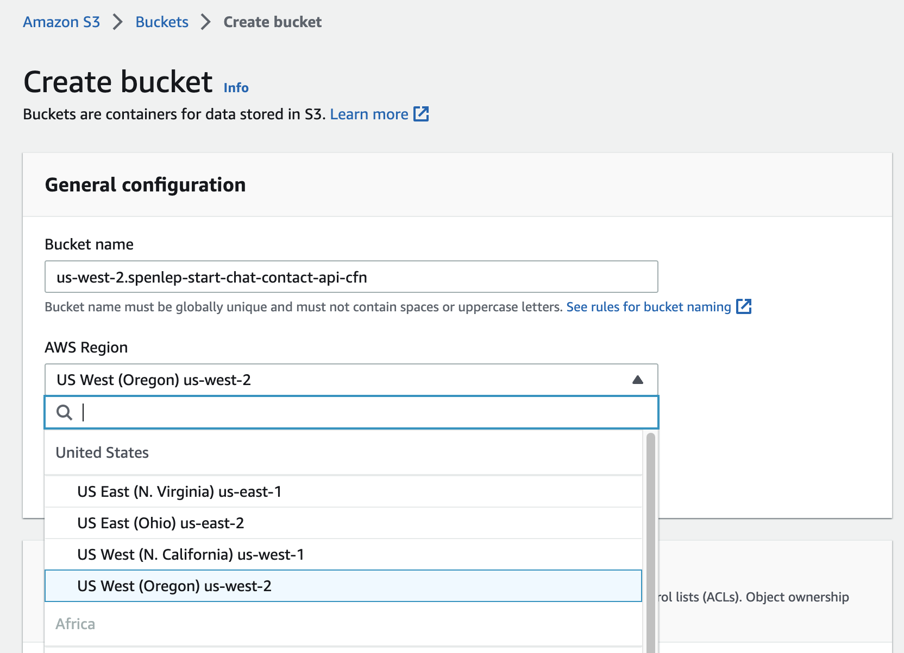
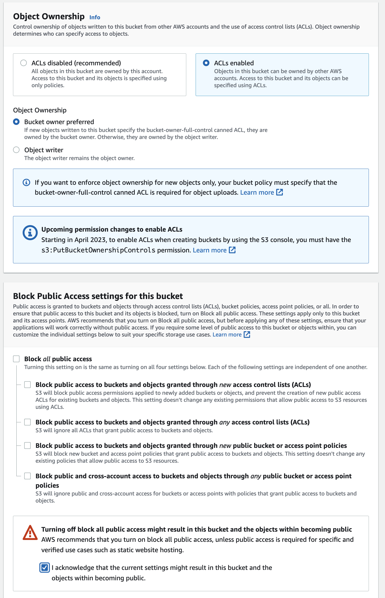
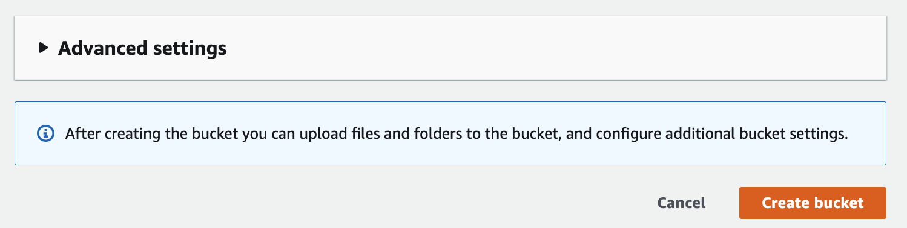
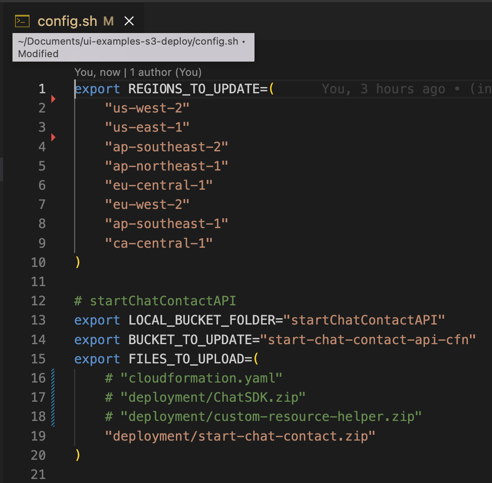
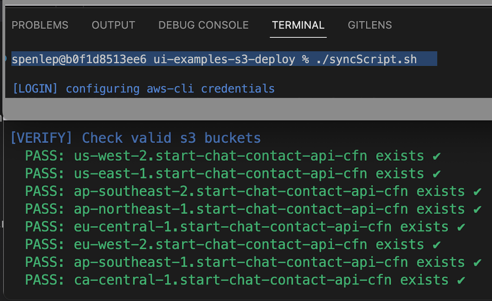
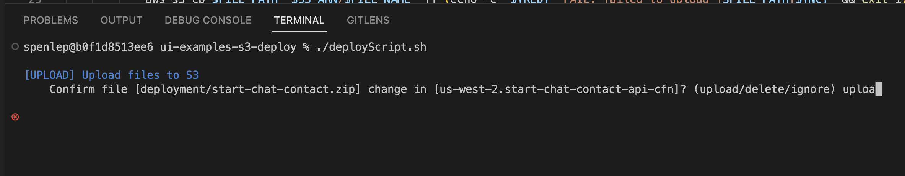

## Demo

1. Create a bucket if needed: `<region>.my-template-cfn`

- 
- 
- 

2. Update the `config.sh` settings before running scripts

- 

3. Sync the s3 buckets to verify existence

- 

4. Upload files one by one, with deploy script

- 