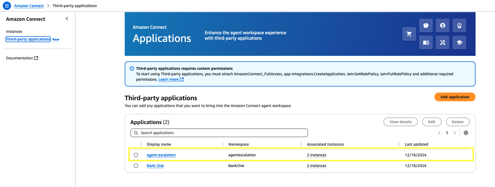
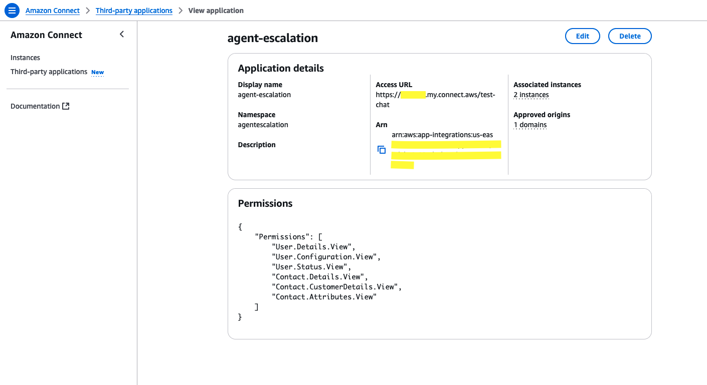
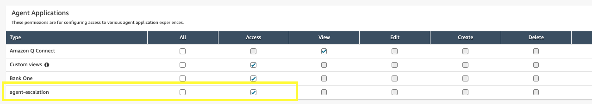

# Amazon Connect Chat UI Examples

This repo contains examples on how to implement the customer side of Amazon Connect chat. Please refer to the README under each solution to see the complete details as to what each solution does and how to deploy it.

**New to Amazon Connect and looking to onboard with Chat/Messaging capabilities?** Refer to the [“Amazon Connect Chat Open Source Walkthrough”](https://github.com/amazon-connect/amazon-connect-chat-ui-examples/blob/master/.github/docs/AmazonConnectChatOpenSourceWalkthrough.md) documentation. We have the following three approaches to get started:

## Approaches

### Option 1: Pre-built Amazon Connect Hosted Widget Snippet

> Follow the Admin Guide Documentation: https://docs.aws.amazon.com/connect/latest/adminguide/add-chat-to-website.html

Add a chat widget to your website that is hosted by Amazon Connect. You can configure the chat widget in the Amazon Connect console: customize the font and colors, and secure the widget so that it can be launched only from your website. As a result, you will have a short code snippet that you add to your website, with latest version always live on your website.

```html
<script type="text/javascript">
  (function(w, d, x, id){s=d.createElement('script');s.src='https://1234lbvr0vu.cloudfront.net/amazon-connect-chat-interface-client.js';s.async=1;s.id=id;d.getElementsByTagName('head')[0].appendChild(s);w[x]=w[x]||function(){(w[x].ac=w[x].ac||[]).push(arguments)}})(window, document, 'amazon_connect', '360f3075-asfd-asfd-asdf-asdf');
  
  amazon_connect('styles', { openChat: { color: '#ffffff', backgroundColor: '#07b62a'}, closeChat: { color: '#ffffff', backgroundColor: '#07b62a'} });
  amazon_connect('snippetId', 'asdf1234asdf1234adsf1234=');
  amazon_connect('supportedMessagingContentTypes', [ 'text/plain', 'text/markdown' ]);
</script>
```


### Option 2: Hosted Widget Snippet Integrated Custom UI (S3 Bucket/CDN)

> Fork the [amazon-connect-chat-interface](https://github.com/amazon-connect/amazon-connect-chat-interface) open source code, and follow steps listed in [HostedSnippetCustomBundleFileSetup.md](https://github.com/amazon-connect/amazon-connect-chat-interface/blob/master/.github/docs/HostedSnippetCustomBundleFileSetup.md) for a full setup walkthrough

Integrate a fully customized chat interface UI in the pre-built Hosted Widget, with all configurations available in the Connect Admin Console. The hosted widget can handle all of the logic to render the widget on your website and start chat sessions.

Host your own `amazon-connect-chat-interface.js` bundle file and provide the link in the widget snippet configuration. 

```diff
<script type="text/javascript">
  (function(w, d, x, id){s=d.createElement('script');s.src='https://1234lbvr0vu.cloudfront.net/amazon-connect-chat-interface-client.js';s.async=1;s.id=id;d.getElementsByTagName('head')[0].appendChild(s);w[x]=w[x]||function(){(w[x].ac=w[x].ac||[]).push(arguments)}})(window, document, 'amazon_connect', '360f3075-asdf-asdf-asdf-sadfsadf1234');
  
  amazon_connect('styles', { openChat: { color: '#ffffff', backgroundColor: '#07b62a'}, closeChat: { color: '#ffffff', backgroundColor: '#07b62a'} });
  amazon_connect('snippetId', 'asdf1234asdf1234adsf1234=');
  amazon_connect('supportedMessagingContentTypes', [ 'text/plain', 'text/markdown' ]);
+ amazon_connect('customerChatInterfaceUrl', 'https://...'); # TODO: put in your link to amazon-connect-chat-interface.js
</script>
```


### Option 3: Customized Widget UI with Hosted Widget Backend
Fully customize the chat interface UI for your website and call the Amazon-hosted backend without setting up your own start chat backend.

### Steps
#### Part 1 - How to customize the widget
1.1 Clone the [amazon-connect-chat-interface](https://github.com/amazon-connect/amazon-connect-chat-interface/tree/master) public repository from Github with the following command:
```
$ git clone https://github.com/amazon-connect/amazon-connect-chat-interface.git
$ cd amazon-connect-chat-interface
$ npm install
$ npm run release
```

1.2 You can customize any of the UI components in `src/components` according to your business requirements.

1.3 Simply make your local modifications to the amazon-connect-chat-interface package, then run `npm install && npm run build`. This command will generate `amazon-connect-chat-interface.js` bundle file within `build/dist/static/js` folder.

1.4 In your website's html code, import the `amazon-connect-chat-interface.js` bundle file with a `<script src="amazon-connect-chat-interface.js"></script>` tag.

#### Part 2 - How to setup Hosted Widget Backend
2.1 To access the Amazon-hosted backend endpoint, you must have a communication widget set up. If you haven't created one yet, please follow the steps in the [Admin guide](https://docs.aws.amazon.com/connect/latest/adminguide/config-com-widget1.html) to configure a new hosted widget.

2.2 Hosted Widget Backend Endpoint Required Info

**Required URL Fields for Endpoint Start Chat API**

`https://{instance_alias}.my.connect.aws/connectwidget/api/{widget_id}/start`
* instance_alias: Refer to [Admin Guide](https://docs.aws.amazon.com/connect/latest/adminguide/find-instance-name.html) to find Instance Alias.
* widget_id: Refer to [Admin Guide](https://docs.aws.amazon.com/connect/latest/adminguide/add-chat-to-website.html#chat-widget-script) to find Widget Id from widget script.

**Required Headers**
* x-amz-snippet-id: Widget snippet ID found in snippet code
* x-amz-security-token: JSON Web Token (optional, only when you choose Yes under **Add security for your communications widget** in widget configuration)


#### Part 3 - Example Usage
The [index.html](https://github.com/amazon-connect/amazon-connect-chat-interface/blob/master/local-testing/index.html) within `amazon-connect-chat-interface/local-testing` folder provides an example html page that you use to test your code.

* Import the `amazon-connect-chat-interface.js` bundle file within a `<script>` tag. [Code Ref](https://github.com/amazon-connect/amazon-connect-chat-interface/blob/master/local-testing/index.html#L9)
* Configure the `apiGatewayEndpoint` in [local-testing/backendEndpoints.js](https://github.com/amazon-connect/amazon-connect-chat-interface/blob/master/local-testing/backendEndpoints.js) and import backendEndpoints.js file within a `<script>` tag. [Code Ref](https://github.com/amazon-connect/amazon-connect-chat-interface/blob/master/local-testing/index.html#L10)
* (Optional) Following Steps in [Admin Guide](https://docs.aws.amazon.com/connect/latest/adminguide/add-chat-to-website.html#confirm-and-copy-chat-widget-script) to use JWT
* Within [`connect.ChatInterface.initiateChat` function](https://github.com/amazon-connect/amazon-connect-chat-interface/blob/master/local-testing/index.html#L66-L79), pass the `x-amz-snippet-id` header and `x-amz-security-token` header (optional)

```diff
connect.ChatInterface.initiateChat({
   name: customerName,
   region,
   apiGatewayEndpoint,
   contactAttributes: JSON.stringify({
         "customerName": customerName
   }),
   featurePermissions: {
         "ATTACHMENTS": false,  // this is the override flag from user for attachments
   },
   supportedMessagingContentTypes: "text/plain,text/markdown", // enable rich messaging
   contactFlowId,
   instanceId,

+  headers: new Headers({
+         'x-amz-snippet-id': '', // TODO: Fill in
+         'x-amz-security-token': '' // (Optional, only when you choose to use JWT) TODO: Fill in
+  })

},successHandler, failureHandler);
```


### Option 4: Hosted widget UI with custom Start Chat API

To get help setting up your own start chat backend and calling your own backend to start the chat contact instead of the Amazon-hosted backend, follow the instructions in the [startChatContactAPI](https://github.com/amazon-connect/amazon-connect-chat-ui-examples/tree/master/cloudformationTemplates/startChatContactAPI) section of the Git repository README to create an API to call the StartChatContact API. Once the API is created, you can call it in the CustomStartChat callback function and send the response back in the widget script.

```diff
<script type="text/javascript">
    (function(w, d, x, id){s=d.createElement('script');s.src='https://${apiId}.cloudfront.net/amazon-connect-chat-interface-client.js';s.async=1;s.id=id;d.getElementsByTagName('head')[0].appendChild(s);w[x]=w[x]||function(){(w[x].ac=w[x].ac||[]).push(arguments)}})(window, document, 'amazon_connect', '360f3075-asfd-asfd-asdf-asdf');

    amazon_connect('styles', { openChat: { color: '#ffffff', backgroundColor: '#07b62a'}, closeChat: { color: '#ffffff', backgroundColor: '#07b62a'} });
    amazon_connect('snippetId', 'replace_with_snippetId');
    amazon_connect('supportedMessagingContentTypes', [ 'text/plain', 'text/markdown' ]);
    ....
+   amazon_connect('customStartChat', async function(callback) {
+         window.fetch('https://replace_with_your_StartChatContact_api_url', {
+            method: "POST",
+            body: JSON.stringify({
+                ConnectInstanceId: "replace_with_testing_instanceId",
+                ContactFlowId: "replace_with_testing_contactflowid",
+                ParticipantDetails: {
+                    DisplayName: "replace_with_testing_displayname",
+                },
+                SupportedMessagingContentTypes: ["text/plain", "text/markdown"],
+                // Note: Since this request goes to your backend, you can customize the payload structure.
+                // The above parameters are examples only - you can modify what information is sent from
+                // the client and handle the actual StartChatContact API parameters on your backend.
+                // add the paramters depends on use case, check StartChatContact API documentation for more details on parameters
+                ....
+            }),
+        }).then((res) => {
+            // 'res' is the raw response object from fetch API
+            // We need to parse the response body using res.json()
+            // to convert it from raw response to JSON format
+            return res.json();
+        }).then(data => {
+            // Example of possible API Response structure:
+            // {
+            //    data: {
+            //      startChatResult: {
+            //          ContactId: string,           // Unique identifier for the chat contact
+            //          ParticipantId: string,      // Unique identifier for the participant
+            //          ParticipantToken: string,   // Authentication token for the chat session
+            //      }
+            //      ...
+            //    }
+            // }
+
+            console.log('data.data:', data.data)
+
+            // Note: The response from the fetch() may have a different structure than shown
+            // above (i.e., may not have data.data wrapper). It depends upon the user's
+            // API response structure, so users need to modify the data extraction accordingly
+
+            // The callback MUST receive data in this structure:
+            // {
+            //     startChatResult: {
+            //         ContactId: string,           // Unique identifier for the chat contact
+            //         ParticipantId: string,      // Unique identifier for the participant
+            //         ParticipantToken: string,   // Authentication token for the chat session
+            //     }
+            // }
+
+            // Pass the extracted data to callback
+            callback(data.data);
+        }).catch(error => {
+            // Handle errors from either the fetch operation
+            // or JSON parsing process
+            console.error('Fetch error:', error);
+        });
+    });
</script>
```

### Option 5: Customized Widget and Chat Interface UI (Self-Hosted)

> Refer to the [customChatWidget example](https://github.com/amazon-connect/amazon-connect-chat-ui-examples/tree/master/customChatWidget) code, and follow steps listed in [CustomChatAndWidgetSelfHostedSetup.md](https://github.com/amazon-connect/amazon-connect-chat-interface/blob/master/.github/docs/CustomChatAndWidgetSelfHostedSetup.md) for a full setup walkthrough

Fully customize the chat interface UI for your website, add a form to collect user info, and customize how the widget is rendered. Host and manage the bundle file yourself, importing it with a `<script src="amazon-connect-chat-interface.js"></script>` tag.


**NOTE:** This approach requires a custom backend to invoke the Amazon Connect Public [StartChatContact](https://docs.aws.amazon.com/connect/latest/APIReference/API_StartChatContact.html) API. Refer to the [startChatContactAPI CloudFormation Template](https://github.com/amazon-connect/amazon-connect-chat-ui-examples/tree/master/cloudformationTemplates/startChatContactAPI) to deploy an API Gateway proxy solution.


## Solutions

At the moment, these are the solutions in this repo:

1. **[cloudformationTemplates/startChatContactAPI](https://github.com/amazon-connect/amazon-connect-chat-ui-examples/tree/master/cloudformationTemplates/startChatContactAPI)**
   The Start Chat Contact API solution creates a simple API to start the chat from the customer side. Use this solution if you want to custom build your customer chat widget. There is also an example html file in this repo that shows you how to make subsequent calls to Chat JS to send messages between the customer and agent after the chat is started.
2. **[cloudformationTemplates/urlPreviewForAsyncChat](https://github.com/amazon-connect/amazon-connect-chat-ui-examples/tree/master/cloudformationTemplates/urlPreviewForAsyncChat)**
   The Url preview for async chat solution is an enhancement of the Async Customer Chat solution, which presents URL previews in chat. For example, entering `www.aws.com` in the chat window will display a rich preview with an image of the website for a better experience. There is also an example html file in this repo that shows you how to make subsequent calls to Chat JS to send messages between the customer and agent after the chat is started.
3. **[samTemplates/amazon-connect-interactive-messages-example](https://github.com/amazon-connect/amazon-connect-chat-ui-examples/tree/master/samTemplates/amazon-connect-interactive-messages-example)**
   Interactive messages in Amazon Connect Chat allow contact centers to provide personalized prompts and response options that customers can easily select from. This serverless application is a sample lambda function which implements Amazon Connect interactive message templates (lists, lists with images, and a time picker) as described in the AWS Contact Center blog post [How to enable interactive messages in Amazon Connect chat](https://aws.amazon.com/blogs/contact-center/easily-set-up-interactive-messages-for-your-amazon-connect-chatbot/).

4. **[samTemplates/amazon-connect-interactive-messages-example-lex-v2](https://github.com/amazon-connect/amazon-connect-chat-ui-examples/tree/master/samTemplates/amazon-connect-interactive-messages-example-lex-v2)**
   Interactive messages in Amazon Connect Chat allow contact centers to provide personalized prompts and response options that customers can easily select from. This serverless application is a sample lambda function which implements Amazon Connect interactive message templates (lists, lists with images, and a time picker).

5. **[customChatWidget](https://github.com/amazon-connect/amazon-connect-chat-ui-examples/tree/master/customChatWidget)**
   Custom Chat Widget for Amazon Connect, with a Chat Form that can be easily plugged into a webpage. This solution helps customers to have Amazon Connect Custom Chat Widget in their website, by applying simple configuration parameters. It also makes customizing the `amazon-connect-interface.js` file easier, and can be used as an easy way to host custom widget on a webpage.

6. **[connectReactNativeChat](https://github.com/amazon-connect/amazon-connect-chat-ui-examples/tree/master/mobileChatExamples/connectReactNativeChat)**
   React Native demo Chat application for Amazon Connect. This cross-platform solution implements basic Chat JS functionality and is fully customizable. Follow the provided documentation to build with [`amazon-connect-chatjs@^1.5.0`](https://github.com/amazon-connect/amazon-connect-chatjs).

7. **[startChatContactAPILocalProxy](https://github.com/amazon-connect/amazon-connect-chat-ui-examples/tree/master/startChatContactAPILocalProxy)**
   Solution to run local proxy server for the Amazon Connect [StartChatContact](https://docs.aws.amazon.com/connect/latest/APIReference/API_StartChatContact.html) Public API. Can be used during local development when building a custom chat interface, prior to deploying a production CloudFormation chat backend.

8. **[hostedWidgetCustomization](https://github.com/amazon-connect/amazon-connect-chat-ui-examples/tree/master/hostedWidgetCustomization)**
   Additional ways to configure the Amazon Connect Hosted Widget on your website and further personalize the branding. This sample code covers several common use cases for customizing the widget snippet code. [Learn more](https://docs.aws.amazon.com/connect/latest/adminguide/add-chat-to-website.html)

9. **[mobileChatExamples](https://github.com/amazon-connect/amazon-connect-chat-ui-examples/tree/master/mobileChatExamples)**
   These native mobile examples of the AWS Connect chat widget are designed for easy integration with a focus on customization. Out-of-the-box ready yet fully adaptable, they offer developers the perfect starting point for incorporating a chat feature that can be fine-tuned to any customer’s requirements.
   
   **Custom Client Support (iOS)**: The iOS example includes custom client implementations that allow you to override AWS Connect Participant Service (ACPS) API methods ([feature commit](https://github.com/amazon-connect/amazon-connect-chat-ios/commit/bde5ea42aa83be826b61ac04e3b9b619d7b8adf9)):
   - **PartialCustomClient**: Override specific methods for logging, monitoring, or analytics while using default AWS implementation for others
   - **CompleteCustomClient**: Override all methods for full control over API routing (e.g., corporate proxy, custom authentication, custom headers)
   
   See `PartialCustomClient.swift` and `CompleteCustomClient.swift` in the iOS example for implementation details.


## Resources

Here are a few resources to help you implement chat in your contact center:

- [Amazon Connect ChatJS](https://github.com/amazon-connect/amazon-connect-chatjs)
- [Amazon Connect Streams](https://github.com/aws/amazon-connect-streams)
- [Amazon Connect Service SDK](https://docs.aws.amazon.com/connect/latest/APIReference/Welcome.html) (Download the SDK [here](https://github.com/aws/))
- [Amazon Connect Participant Service SDK](https://docs.aws.amazon.com/connect-participant/latest/APIReference/Welcome.html) (Download the SDK [here](https://github.com/aws/))
- [iOS Mobile SDK](https://github.com/aws-amplify/aws-sdk-ios)
  - [Amazon Connect Participant Service](https://cocoapods.org/pods/AWSConnectParticipant)
  - [Amazon Connect Service](https://cocoapods.org/pods/AWSConnect)
- [Android SDK](https://github.com/aws-amplify/aws-sdk-android)
- [Open source code for the Chat Interface](https://github.com/amazon-connect/amazon-connect-chat-interface)

## Enabling Chat in an Existing Amazon Connect Contact Center

If your instance was created before the release of the chat feature, here's an overview of what you need to do to enable chat, as well as what has changed.

1. Because you have an existing instance, you'll need to enable chat testing mode to use the simulated environment we've provided for testing. Follow these steps: 
    1. In Amazon Connect, choose Users, Security profiles. 
    2. Select the security profile that you want update, such as Admin. 
    3. Expand Numbers and flows. 
    4. For Chat test mode choose Enable/Disable. 
    5. Choose Save. Now people who are assigned to that security profile will be able to use the simulated chat experience.  
    _Note: Another option is to create a new security profile specifically for testing chat and assign testers to that profile._
    

2. Enable Chat in your Routing Profile. Go into your instance's website and go to the Routing Profiles section. Edit the Routing Profile for your agent and add the Basic Queue to the profile with the chat channel enabled.
    
3. Your existing contacts flows will also work for chat! You just need to update them to specify how you want them to work.
    We've added the following action blocks:

    - [Wait](https://docs.aws.amazon.com/connect/latest/adminguide/wait.html)
    - [Set disconnect flow](https://docs.aws.amazon.com/connect/latest/adminguide/set-disconnect-flow.html)

    And updated these blocks for chat:

    - [Play prompt](https://docs.aws.amazon.com/connect/latest/adminguide/play.html)
    - [Get customer input](https://docs.aws.amazon.com/connect/latest/adminguide/get-customer-input.html)
    - [Store customer input](https://docs.aws.amazon.com/connect/latest/adminguide/store-customer-input.html)
    - [Set recording behavior](https://docs.aws.amazon.com/connect/latest/adminguide/set-recording-behavior.html)

4. Your metric reports and the contact trace records will now reflect chat as a channel. Note the following metrics:

    - [Agent Activity](https://docs.aws.amazon.com/connect/latest/adminguide/real-time-metrics-definitions.html#agent-activity-state-real-time): This metric used to be named Agent Status. Existing reports that used Agent Status as the column name will start using Agent Activity as the column name.
    - [Availability](https://docs.aws.amazon.com/connect/latest/adminguide/real-time-metrics-definitions.html#availability-real-time): This metric has a new definition to account for chat. The change has no impact on metrics for voice calls.
    - [Capacity](https://docs.aws.amazon.com/connect/latest/adminguide/real-time-metrics-definitions.html#capacity-real-time): This is a new real-time metric.
    - [Contact State](https://docs.aws.amazon.com/connect/latest/adminguide/real-time-metrics-definitions.html#contact-state-real-time): This metric has a few changes so the states are better aligned to what the agent sees in the updated CCP.

    Check out the Real-time Metrics Definitions and Historical Metrics Definitions. These articles have been updated to reflect the addition of chat.

5. Enable Chat Transcripts in the Amazon Connect console by viewing your instance settings and clicking on the 'Data Storage' section and adding an S3 bucket in the 'Chat Transcripts' section.
    
6. If your business is using Amazon Lex bots in your contact center, and your Amazon Connect instance was created before October 12, 2018, we recommend doing the following step to ensure your service-linked role has "lex:PostText" permissions:
    - Add a new Amazon Lex bot (and then you can remove it). The act of adding the Amazon Lex bot will automatically update your permissions.
7. When you're ready to deploy the updated CCP, give the URL for it to those agents who are going handle voice and chat contacts, or only chat contacts. Those agents who are only handling voice contacts can continue using the original CCP. To learn more about the updated CCP interface, see [Chat with Contacts](https://docs.aws.amazon.com/connect/latest/adminguide/work-with-chats.html).
8. For instances created prior to October 12, 2018, the Test Chat experience in the Amazon Connect website is not available. Please follow instructions in the [asyncCustomerChatUX solution](https://github.com/amazon-connect/amazon-connect-chat-ui-examples/tree/master/cloudformationTemplates/asyncCustomerChatUX) to deploy your own sample customer UI and test chat.
9. Enable interactive messages for your chat widget in Amazon Connect by reading the blog on how to [easily set up interactive messages for your Amazon Connect chatbot](https://aws.amazon.com/blogs/contact-center/easily-set-up-interactive-messages-for-your-amazon-connect-chatbot/) for detailed instructions.

## Enabling Agent-to-Agent Communication in an Existing Contact Center

Amazon Connect Agent worksapce supports 3P app integration (more details in [Getting started with third-party applications](https://aws.amazon.com/blogs/contact-center/getting-started-with-third-party-applications-in-the-agent-workspace/)), which can be leveraged to setup Agent-to-Agent chat/video/voice/screen-share integrations. You can chat with other agents, seek advise, setup routing rules, create agent groups, supervise agents or inform of a customer call transfer and, much more.

<video src="https://github.com/user-attachments/assets/544f2bcd-2fbd-4462-a549-c3c6ed5db845"></video>

https://github.com/mhiaror/amazon-connect-chat-ui-examples/blob/master/.github/screenshots/AgentWorkspaceChatDemo.mp4

To integrate agent-to-agent chat, you need a chat initiator application (which an Agent can use to initiate a chat) and a chat receiver application (which an Agent can use to accept internal chat).
   1. To create a chat initiator application for Agents, you can either [create a new connect instance](https://docs.aws.amazon.com/connect/latest/adminguide/amazon-connect-instances.html) or use the same connect instance. Login to your connect instance.
   2. Next, we need to setup internal contact center for agent-to-agent contact. Follow the steps to a/ Setup your channels (Voice, Chat, Video, Screen-share etc) b/ Add users and agents c/ Setup routing etc. Detailed setup can be found at [Get Started : Setup your contact center](https://docs.aws.amazon.com/connect/latest/adminguide/amazon-connect-contact-centers.html).
   3. To create a *Chat Initiator application*, you have 2 options
      1. Create a communication widget within your connect instance by following the documentation, [Add a chat user interface to your website](https://docs.aws.amazon.com/connect/latest/adminguide/add-chat-to-website.html). You can Embed the generated code snippet from the communication widget page into your webpage/website.
      2. Use the test-chat page as Agent Chat Initiator https://<instance-alias>.my.connect.aws/test-chat and, share ContactFlowId with Agents so they can initiate contact.
      3. You can integrate *Chat Initiator application* within existing Agent workspace as a third-party application. Above video demo shows how Agents can open the 3P application within Agent workspace.
   4. For the *Chat receiver application*, you can use the default CCP Client,  Agent workspace or Test chat page itself. Note: You can use the https://<instance-alias>.my.connect.aws/test-chat page and integrate it as a third-party application within existing Agent workspace.
   
   ### How to integrate Test Chat page as a third party application within Agent workspace

   

   1. Open the Amazon Connect [console]((https://console.aws.amazon.com/connect/))
   2. Enable *Third party applications* on the left hand side, select *Add application*
   
   3. Add the application Name, description and provide test-chat page url https://<instance-alias>.my.connect.aws/test-chat
   
   4. Associate your application to your Amazon Connect instances.
   5. Add security profile permissions for Agent to access third-party application
   
   6. Use the Agent workspace app launcher, to access third-party application you created above. The app launcher should show the list of applications an Agent has access to (configured using security profile in step#5)


## Troubleshooting and Support

Review the resources given in the README files for guidance on how to develop on this library. Additionally, search our [issues database](https://github.com/amazon-connect/amazon-connect-chat-ui-examples/issues) to see if your issue is already addressed. If not please cut us an [issue](https://github.com/amazon-connect/amazon-connect-chat-interface/issues/new/choose) using the provided templates.

If you have more questions, or require support for your business, you can reach out to [AWS Customer support](https://aws.amazon.com/contact-us). You can review our support plans [here](https://aws.amazon.com/premiumsupport/plans/?nc=sn&loc=1).

## License Summary

This sample code is made available under the MIT-0 license. See the LICENSE file.
