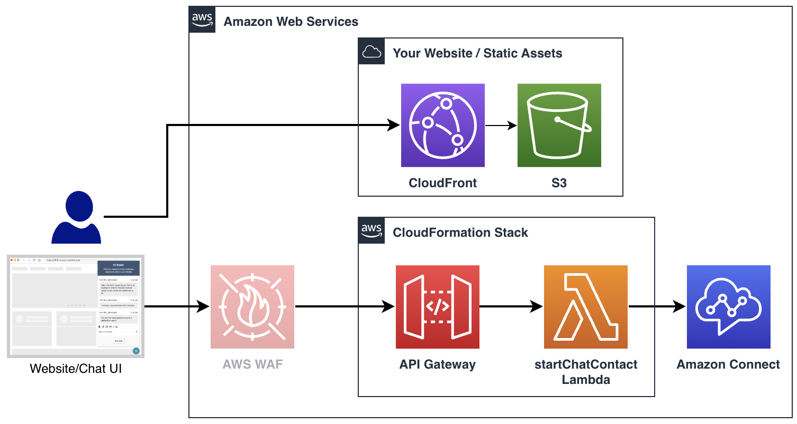
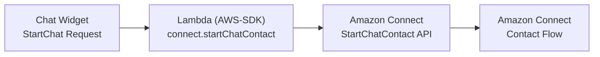

# Overview

Adding chat to your website is possible with a few easy steps. This solutions spins up an [Amazon API Gateway](https://aws.amazon.com/api-gateway/) endpoint that triggers an [AWS Lambda](https://aws.amazon.com/lambda/) function. This Lambda function invokes the [Amazon Connect](https://aws.amazon.com/connect/) Service [StartChatContact](https://docs.aws.amazon.com/en_pv/connect/latest/APIReference/API_StartChatContact.html) API and returns the result from that call. Once you have the StartChatContact API you can either pass that response to the prebuilt widget to get a quick implementation going or you can build your own customer chat experience by using the [Amazon Connect Chat JS]( https://github.com/amazon-connect/amazon-connect-chatjs)  library.

> ⚠️ This sample code does not come with built in security. It is highly recommended to implement [AWS WAF](https://docs.aws.amazon.com/apigateway/latest/developerguide/apigateway-control-access-aws-waf.html) for the API Gateway.



## CloudFormation Deployment Steps

### Pre-requisites

You need an Amazon Connect instance to deploy this [CloudFormation](https://aws.amazon.com/cloudformation/) template. You can use an existing one or create a new one by following our onboarding guide [here](https://docs.aws.amazon.com/connect/latest/adminguide/amazon-connect-get-started.html).

If you are using an existing instance, you may need to make a few changes to your instance to enable Chat. Follow the steps [here](https://github.com/amazon-connect/amazon-connect-chat-ui-examples/blob/master/README.md#enabling-chat-in-an-existing-amazon-connect-contact-center) to see what changes you need to make.

### Steps

| Region | Launch Button |
| ------ | ------------- |
| us-east-1 (N. Virginia) | [](https://console.aws.amazon.com/cloudformation/home#/stacks/new?stackName=startChatContactAPI&templateURL=https://s3.amazonaws.com/us-east-1.start-chat-contact-proxy-cfn/cloudformation.yaml) |
| us-west-2 (Oregon) | [](https://us-west-2.console.aws.amazon.com/cloudformation/home#/stacks/new?stackName=startChatContactAPI&templateURL=https://s3-us-west-2.amazonaws.com/us-west-2.start-chat-contact-proxy-cfn/cloudformation.yaml) |
| ap-southeast-2 (Sydney) | [](https://ap-southeast-2.console.aws.amazon.com/cloudformation/home#/stacks/new?stackName=startChatContactAPI&templateURL=https://s3-ap-southeast-2.amazonaws.com/ap-southeast-2.start-chat-contact-proxy-cfn/cloudformation.yaml) |
| ap-northeast-1 (Tokyo) | [](https://ap-northeast-1.console.aws.amazon.com/cloudformation/home#/stacks/new?stackName=startChatContactAPI&templateURL=https://s3-ap-northeast-1.amazonaws.com/ap-northeast-1.start-chat-contact-proxy-cfn/cloudformation.yaml) |
| eu-central-1 (Frankfurt) | [](https://eu-central-1.console.aws.amazon.com/cloudformation/home#/stacks/new?stackName=startChatContactAPI&templateURL=https://s3-eu-central-1.amazonaws.com/eu-central-1.start-chat-contact-proxy-cfn/cloudformation.yaml) |
| eu-west-2 (London) | [](https://eu-west-2.console.aws.amazon.com/cloudformation/home#/stacks/new?stackName=startChatContactAPI&templateURL=https://s3-eu-west-2.amazonaws.com/eu-west-2.start-chat-contact-proxy-cfn/cloudformation.yaml) |
| ap-southeast-1 (Singapore) | [](https://ap-southeast-1.console.aws.amazon.com/cloudformation/home#/stacks/new?stackName=startChatContactAPI&templateURL=https://s3-ap-southeast-1.amazonaws.com/ap-southeast-1.start-chat-contact-proxy-cfn/cloudformation.yaml) |
| ca-central-1 (Canada) | [](https://ca-central-1.console.aws.amazon.com/cloudformation/home#/stacks/new?stackName=startChatContactAPI&templateURL=https://s3-ca-central-1.amazonaws.com/ca-central-1.start-chat-contact-proxy-cfn/cloudformation.yaml) |
| ap-northeast-2 (Seoul) | [](https://ap-northeast-2.console.aws.amazon.com/cloudformation/home#/stacks/new?stackName=startChatContactAPI&templateURL=https://s3-ap-northeast-2.amazonaws.com/ap-northeast-2.start-chat-contact-proxy-cfn/cloudformation.yaml) |

1) Deploy the CloudFormation template from one of the links above.
    - Enter the Contact Flow id and Instance Id that you would like to test with. These are added as Lambda environment variables.
        - `contactFlowId`: You can find the contact flow id when viewing a contact flow. For example, if the arn for your flow is 'arn:aws:connect:us-west-2:123456789012:instance/11111111-1111-1111-1111-111111111111/contact-flow/22222222-2222-2222-2222-222222222222', the contact flow id is '22222222-2222-2222-2222-222222222222'
        - `instanceId`: This is the id of the instance you want to use. You can find this on the Amazon Connect console or when viewing the contact flow. For example, if the arn for your flow is 'arn:aws:connect:us-west-2:123456789012:instance/11111111-1111-1111-1111-111111111111/contact-flow/22222222-2222-2222-2222-222222222222', the instance id is '11111111-1111-1111-1111-111111111111'
2) Once the stack has launched you can call the API from your website. Follow the steps below to see how you can call this API using our pre-built chat widget or by building out your own UX.
    
## Prebuilt Chat Widget
If you want to add the customer chat widget (that is available in the Test Chat experience in the Amazon Connect website) to your website, here are the steps to do so. You can also refer to the `widgetIndex.html` file in this repo to see an example of how to use the widget.

Note: you will want to show the widget only when there is a conversation in progress. If the widget is visible when there is no conversation, you will just see a loading spinner.

1. In your website's html code, import the 'amazon-connect-chat-interface.js' file from this repo. If you want to modify the code in the interface.js file, you can refer to [this repo](https://github.com/amazon-connect/amazon-connect-chat-interface) to see its source.

    ```html
    <script src="amazon-connect-chat-interface.js"></script>
    ```

2. Initialize the Chat Interface on page load. Note: you need to update this to include the root id of the div where the customer chat widget will live.

    ```js
    $(document).ready((a) => {
      connect.ChatInterface.init({
        containerId: 'root', // This is the id of the container where you want the widget to reside
        headerConfig: {      // Use the optional headerConfig and footerConfig to customize your widget
          isHTML: true,
          render: () => {
            return (`<html code here/>`)
          }
        },
        footerConfig: {
          isHTML: true,
          render: () => {
            return (`<html code here/>`)
          }
        }
      });
    });
    ```

3. Start the chat based on a user action. You will want to add fields for the customer name, username, and enableAttachments because those fields are used in the Lambda function that was created.

     Note: you need to update this to include the API Gateway endpoint that was created in the CloudFormation stack. To see examples of the success and failure handlers, refer to the [example implementation](https://github.com/amazon-connect/amazon-connect-chat-ui-examples/blob/master/cloudformationTemplates/asyncCustomerChatUX/website/index.html#L283).

     ⚠️ **Authentication Notice:** Please be aware that this API does not come with built-in authentication. By default, it is accessible to       anyone with the API Gateway endpoint. It is imperative to assume responsibility for implementing the necessary authentication mechanisms to secure access to this API.

    ```js
    connect.ChatInterface.initiateChat({
      name: customerName,
      username: username,
      region: ${region},
      apiGatewayEndpoint: "https://${apiId}.execute-api.${region}.amazonaws.com/Prod",
      contactAttributes: JSON.stringify({
        "customerName": customerName
      }),
      contactFlowId: "${contactFlowId}",
      instanceId: "${instanceId}",
      featurePermissions: {
        "ATTACHMENTS": enableAttachments==='true',  // this is the override flag from user for attachments
        }
    },successHandler, failureHandler)
    ```

## Creating your own Chat UX

If you want to build your own Chat widget instead of using our prebuilt one, follow these step by step directions. If you want to see a complete example of how to use [ChatJS](https://github.com/amazon-connect/amazon-connect-chat-js), look at the  `customBuildIndex.html` file.

1) First, you need deploy the backend API as instructed above.
2) Once your stack is deployed, go to the [API Gateway console](https://console.aws.amazon.com/apigateway/home), select the API, go to the Stages menu item, and select the `Prod` stage. You will then see the `Invoke URL`. This is the URL you will invoke to start the chat.

3) Gather the instance ID and contact flow ID you want to use. If you don't have a contact flow, use the `Sample inbound flow` one in your instance that is created by default. You can find these IDs when viewing a contact flow. For example, if the arn for your flow is `arn:aws:connect:us-west-2:123456789012:instance/11111111-1111-1111-1111-111111111111/contact-flow/22222222-2222-2222-2222-222222222222`, the instance ID is `11111111-1111-1111-1111-111111111111` and the contact flow ID is `22222222-2222-2222-2222-222222222222`

4) Download the [compiled ChatJS source](https://github.com/amazon-connect/amazon-connect-chatjs/blob/master/dist/amazon-connect-chat.js) and save it locally.
5) Create an `index.html` file in the same directory as the ChatJS source
6) Set up your `index.html` file by importing ChatJS and creating the html elements you will use. These include an entry for the customer's name, a chat content input field, an area for the chat transcript to show up, and buttons to start the chat, get the transcript, send a typing event, and end the chat. 

```html
<!DOCTYPE html>
<html>

<head>
    <title></title>
    <meta name="viewport" content="width=device-width, initial-scale=1">
    <meta http-equiv="Content-Type" content="text/html; charset=utf-8" />

    <script src="https://code.jquery.com/jquery-3.1.0.min.js"></script>
    <script src="https://code.jquery.com/ui/1.12.1/jquery-ui.js"></script>
    <script type="text/javascript" src="amazon-connect-chat.js"></script>
</head>
<body>
    <div>
        <section class="section-main" id="section-main">
            <header>
                <h1>Amazon Connect - Custom Implementation of Customer Chat</h1>
            </header>

            <form name="contactDetails" id="contactDetails" style="padding-top: 30px; padding: 5px;">
                <div>
                    <table>
                        <tbody>
                            <tr>
                                <td>
                                    <input name="firstName" type="text" id="firstName" placeholder="First Name"
                                        style="width:161px;">
                                </td>
                                <td style="padding-left: 10px;">
                                    <input type="submit" style="padding-left: 10px;" class="submit" id="startChat"
                                        value="Start Chat"></input>
                                </td>
                            </tr>
                        </tbody>
                    </table>
                </div>
            </form>
            
            <div style="padding: 5px;"><textarea type="text" id="chatContent"></textarea></div>
            <div style="padding: 5px;"><input type="button" id="sendChat" value="Send chat"></div>
            <div style="padding-top: 10px; display: inline-flex">
                <div style="padding: 5px;"><input type="button" id="getTranscript" value="Get Transcript"></div>
                <div style="padding: 5px;"><input type="button" id="sendTyping" value="Send typing"></div>
                <div style="padding: 5px;"><input type="button" id="endChat" value="End chat"></div>
            </div>
            <div style="padding: 5px;"><textarea readonly id="chatTranscript"></textarea></div>
        </section>
    </div>

    <script>
    </script>
</body>
```
7) Once you have the outline ready, the first step is to set up the chat session. Add the below code to set the global config in the `<script>` section of your `index.html` file. You are also creating a global variable, `session`, that will be initialized at a later step.

```js
var session;

connect.ChatSession.setGlobalConfig({
    region: "us-east-1" // TODO: update with the region your Amazon Connect instance is in
});
```

8) Next, you will call the [StartChatContact API](https://docs.aws.amazon.com/connect/latest/APIReference/API_StartChatContact.html) in the Amazon Connect Service. This call to StartChatContact is made through the API that was deployed by the stack. You need to fill in a few fields here: contact flow id, instance id, and the API Gateway endpoint. Add this code after the function to set the global config. 

```js
$(function () {
    $('#contactDetails').submit(function (e) {
        e.preventDefault();

        customerName = $('#firstName').val();
        if (!customerName) {
            alert('you must enter a name');
        } else {
            var contactFlowId = "12345678-1234-1234-1234-123456789012"; // TODO: Fill in
            var instanceId = "12345678-1234-1234-1234-123456789012"; // TODO: Fill in
            var apiGatewayEndpoint = "https://0123456789.execute-api.us-east-1.amazonaws.com/Prod"; // TODO: Fill in 
            
            document.getElementById("contactDetails").reset();

            var initiateChatRequest = {
                ParticipantDetails: {
                    DisplayName: customerName
                },
                ContactFlowId: contactFlowId,
                InstanceId: instanceId
            };

            $.ajax({
                url: apiGatewayEndpoint,
                type: "POST",
                async: false,
                data: JSON.stringify(initiateChatRequest),
                success: function(result) {
                    console.log("Success!");
                    console.log(JSON.stringify(result));
                },
                error: function(result) {
                    console.log("Error:");
                    console.log(result);
                }
            });
        }
    });
});
```
9) At this point you can test your implementation by opening your index.html file, entering a name, and clicking `Start Chat`. If you inspect the console of your browser, you should see a success log.
10) Now that you can successfully call ACS.StartChatContact(), you need to complete the chat initialization by making a call to ChatJS to establish the chat session. You will do this in the success function after your ajax call to start the chat. Pass the result from the call to start chat to ChatJS and ChatJS will handle the rest of the steps to establish the connection.

```js
success: function(result) {
    console.log("Success!");
    console.log(JSON.stringify(result));
    session = connect.ChatSession.create({
        chatDetails: result.data.startChatResult,
        type: "CUSTOMER"
    });
},
```
11) Once the session is created, you need to give function definitions for the APIs available in ChatJS that respond to events and messages. You can define the functions within the `complete` function after the ajax call. Your ajax call will now look like this:

```js
$.ajax({
    url: apiGatewayEndpoint,
    type: "POST",
    async: false,
    data: JSON.stringify(initiateChatRequest),
    success: function(result) {
        console.log("Success!");
        console.log(JSON.stringify(result));
        session = connect.ChatSession.create({
            chatDetails: result.data.startChatResult,
            type: "CUSTOMER"
        });
    },
    error: function(result) {
        console.log("Error:");
        console.log(result);
    },
    complete: function(data) {
        session.connect().then((response) => {
            console.log("Successful connection: " + JSON.stringify(response));
            return response;
        }, (error) => {
            console.log("Unsuccessful connection " + JSON.stringify(error));
            return Promise.reject(error);
        });

        session.onConnectionEstablished((data) => {
            console.log("Established!");
        })

        session.onMessage((message) => {
            console.log("Received message: " + JSON.stringify(message));
        });

        session.onTyping((typingEvent) => {
            console.log("Received typing event: " + JSON.stringify(typingEvent));
        });

        session.onConnectionBroken((data) => {
            console.log("Connection broken.");
        });
    }
});
```
12) Now that the reactive functions have definitions, the final step is to add definitions for all the APIs that can be triggered by the customer. Add this functions under the ajax call within the `<script>` section.

```js
$(document).ready((a) => {
    $("#sendChat").click(() => { 
        sendChat();
    });

    $("#getTranscript").click(() => { 
        getTranscript();
    });

    $("#endChat").click(() => { 
        endChat();
    });

    $("#sendTyping").click(() => { 
        sendTypingEvent();
    });
});

function sendChat() {
    var message = document.getElementById("chatContent").value;
    console.log("Clicked with message " + message);

    session.controller.sendMessage({
        message: message,
        contentType: "text/plain"
    })
}

function getTranscript() {
    session.getTranscript({
        scanDirection: "BACKWARD",
        sortOrder: "ASCENDING",
        maxResults: 15
    }).then(response => {
        console.log("Current transcript: ");
        console.log(JSON.stringify(response.data.Transcript));
        $('#chatTranscript').text(JSON.stringify(response.data.Transcript));
    });
}

function endChat() {
    session.controller.disconnectParticipant();
}

function sendTypingEvent() {
    session.controller.sendEvent({
        contentType: "application/vnd.amazonaws.connect.event.typing"
    });
}
```

13) That's it! Now if you test your index.html file all of the buttons should work and if you inspect the console you will see logs for the events being sent and received through ChatJs.


## Enabling interactive messages
If you want to enable interactive messages for Amazon Connect Chat the customer chat widget (that is available in the Test Chat experience in the Amazon Connect website) to your website, read the blog on how to [easily set up interactive messages for your Amazon Connect chatbot](https://aws.amazon.com/blogs/contact-center/easily-set-up-interactive-messages-for-your-amazon-connect-chatbot/) for detailed instructions.

*What are interactive messages for Amazon Connect Chat?*

Interactive messages are pre-configured responses that your users can select from, making it easy for your customers to quickly resolve their issues through chat. Interactive messages can be designed using the new Amazon Connect Chat templates, which include several different customer display options like list pickers, list pickers with images, and time pickers. These are sent by Amazon Connect Chat using Amazon Lex chatbots. Interactive messages configured through Lex will be validated in the Amazon Connect contact flow to ensure that they have been configured correctly.


## Enabling attachments
If you want to enable sending attachments for Amazon Connect Chat the customer chat widget, follow the instructions in the [documentation](https://docs.aws.amazon.com/connect/latest/adminguide/enable-attachments.html)  to enable your Amazon Connect instance for attachments. Once enabled, you can mark the  `ATTACHMENTS` flag in `connect.ChatInterface.initiateChat` as `true`. Example below:

```js
    connect.ChatInterface.initiateChat({
      name: customerName,
      username: username,
      region: ${region},
      apiGatewayEndpoint: "https://${apiId}.execute-api.${region}.amazonaws.com/Prod",
      contactAttributes: JSON.stringify({
        "customerName": customerName
      }),
      contactFlowId: "${contactFlowId}",
      instanceId: "${instanceId}",
      featurePermissions: {
        "ATTACHMENTS": true,  // this is the override flag from user for attachments
        }
    },successHandler, failureHandler)
```

## Enabling rich messaging

Amazon Connect Chat now allows your agents and customers to use rich text formatting when composing a message, enabling them to quickly add emphasis and structure to messages, improving comprehension. The available formatting options include bold, italics, hyperlinks, bulleted lists, and numbered lists. [Documentation](https://docs.aws.amazon.com/connect/latest/adminguide/enable-text-formatting-chat.html)

1. To enable rich messaging, include the new param when invoking `initiateChat`:

```js
  connect.ChatInterface.initiateChat({
    contactFlowId: "${contactFlowId}",
    instanceId: "${instanceId}",
    // ...
    supportedMessagingContentTypes: "text/plain,text/markdown", // include 'text/markdown' for rich messaging support
    featurePermissions: {
      ATTACHMENTS: false,
      MESSAGING_MARKDOWN: true
    }
  },successHandler, failureHandler)
```

2. If updating an exisiting CFN stack, the startChatContact lambda function needs to be updated.

Be sure to pass `supportedMessagingContentTypes` input to `startChatContact()`:

```js
function startChatContact(body) {
    return new Promise(function (resolve, reject) {
        var startChat = {
            // ...
            ...(!!body["SupportedMessagingContentTypes"] && { "SupportedMessagingContentTypes": body["SupportedMessagingContentTypes"] })
        };
    })
}
```

## Enabling message receipts

Render and send read/delivered message receipts for customer chat-interface. Enable the feature [in the admin console](https://docs.aws.amazon.com/connect/latest/adminguide/message-receipts.html), and update [`chat-interface`](https://github.com/amazon-connect/amazon-connect-chat-interface#message-receipts) to generate latest webpack bundle.

To customize wait time before sending read/delivered receipt, set the throttle in global config:

```js
connect.ChatSession.setGlobalConfig({
  // ...
  features: {
    messageReceipts: {
      shouldSendMessageReceipts: true,
      throttleTime: 5000 // default throttle time in ms - time to wait before sending 
    }
  }
});
```

## Disable message receipts

By default, message receipts feature is enabled in ChatJs. [Disable in `chat-interface`](https://github.com/amazon-connect/amazon-connect-chat-interface#message-receipts) config and remove from the ChatJs config:

```js
connect.ChatSession.setGlobalConfig({
  // ...
  features: {
    messageReceipts: {
      shouldSendMessageReceipts: false, // default: true
    }
  }
});
```

## Enable persistent chat

Learn more about persistent chat: https://docs.aws.amazon.com/connect/latest/adminguide/chat-persistence.html

You can enable persistent chat in [`widgetIndex.html`](https://github.com/amazon-connect/amazon-connect-chat-ui-examples/blob/master/cloudformationTemplates/startChatContactAPI/widgetIndex.html).

```
connect.ChatInterface.initiateChat({
    ...
    persistentChat: {
        rehydrationType: "", // TODO: ENTIRE_PAST_SESSION or FROM_SEGMENT
        // ENTIRE_PAST_SESSION: specify the first contact (initial contactId) of the past chat session as the SourceContactId attribute.
        // FROM_SEGMENT: specify any contactId of the past chat session as the SourceContactId attribute.
        sourceContactId: "" // TODO: Fill in contactId based on rehydrationType
    },
    ...
}, successHandler, failureHandler);
```

## Custom chat duration

Learn more about chat duration: https://docs.aws.amazon.com/connect/latest/APIReference/API_StartChatContact.html#connect-StartChatContact-request-ChatDurationInMinutes

You can set custom chat duration in [`widgetIndex.html`](https://github.com/amazon-connect/amazon-connect-chat-ui-examples/blob/master/cloudformationTemplates/startChatContactAPI/widgetIndex.html).

```
connect.ChatInterface.initiateChat({
    ...
    chatDurationInMinutes: 1500, // min 60, max 10080 - default 1500 (25 hours)
    ...
}, successHandler, failureHandler);
```

## Passing Custom Attribute to Contact Flow

When initializing the chat with a StartChatContact request, you can pass custom attributes to the the contact flow. 



### Reference

 - `StartChatContact` API - [Documentation](https://docs.aws.amazon.com/connect/latest/APIReference/API_StartChatContact.html)
 - Admin Guide - ["Use Amazon Connect contact attributes"](https://docs.aws.amazon.com/connect/latest/adminguide/connect-contact-attributes.html)
 - Example `startChatContactAPI` Lambda - [CloudFormation Template](https://github.com/amazon-connect/amazon-connect-chat-ui-examples/blob/master/cloudformationTemplates/startChatContactAPI/js/startChatContact.js)
 
 
### Configuration

1. If using the GitHub [`AmazonConnectChatWidget`](https://github.com/amazon-connect/amazon-connect-chat-interface), pass in custom `contactAttributes` to the `ChatInterface.initiateChat()` method. This will pass `"Attributes"` key in the request body

```js
// https://github.com/amazon-connect/amazon-connect-chat-interface/blob/master/src/components/Chat/ChatInitiator.js

connect.ChatInterface.initiateChat({
  name: customerName,
  region: ${region},
  contactFlowId: "${contactFlowId}",
  instanceId: "${instanceId}",
  apiGatewayEndpoint: "${apiGatewayEndpoint}",
  contactAttributes: JSON.stringify({
    "customerName": customerName,
    "customAttribute": "myCustomAttribute". // <------ CUSTOM ATTRIBUTE HERE
  }),
  
},successHandler, failureHandler)
```
    
2. Update the lambda making the [`StartChatContact`](https://docs.aws.amazon.com/connect/latest/APIReference/API_StartChatContact.html) call, make sure to forward `body["Attributes"]` to `connect.startChatContact()`

```js
/*
  Example `startChatContactAPI` lambda making a call to the Amazon Connect public StartChatContact API
  
  LINK: https://github.com/amazon-connect/amazon-connect-chat-ui-examples/blob/master/cloudformationTemplates/startChatContactAPI/js/startChatContact.js

  1) Chat Widget will make request to this Lambda
  2) Lambda will forward the request to the Amazon Connect Backend
*/

var AWS = require('aws-sdk');
AWS.config.update({region: process.env.REGION});
var connect = new AWS.Connect();

exports.handler = (event, context, callback) => {
    console.log("Received event: " + JSON.stringify(event));
    var body = JSON.parse(event["body"]);

    startChatContact(body).then((startChatResult) => {
        callback(null, buildSuccessfulResponse(startChatResult));
    }).catch((err) => {
        console.log("caught error " + err);
        callback(null, buildResponseFailed(err));
    });
};

function startChatContact(body) {
	return new Promise(function (resolve, reject) {
        var startChat = {
            "InstanceId": body["InstanceId"],
            "ContactFlowId": body["contactFlowId"],
            "Attributes": {
                "customerName": body["ParticipantDetails"]["DisplayName"],
                // ...
                ...body["Attributes"] // <------ CUSTOM ATTRIBUTE HERE
            },
            "ParticipantDetails": {
                "DisplayName": body["ParticipantDetails"]["DisplayName"]
            },
        };
        
        // https://docs.aws.amazon.com/connect/latest/APIReference/API_StartChatContact.html
        connect.startChatContact(startChat, function(err, data) {
            if (err) {
                console.log("Error starting the chat.", err);
                reject(err);
            } else {
                console.log("Start chat succeeded with the response: " + JSON.stringify(data));
                resolve(data);
            }
        });
    });
}
```

3. Consume the new attribute in the contact flow. Refer to the Admin Guide - ["Use Amazon Connect contact attributes"](https://docs.aws.amazon.com/connect/latest/adminguide/connect-contact-attributes.html)


## [Maintainers Only] Publish CloudFormation Stack to S3

Follow these steps to publish the **startChatContactAPI** CloudFormation template.

### Prerequisites

- Install AWS CLI (`aws --version`)
- Access to AWS account `533267401313` (ask @spenlep-amzn)

### Context

Customers can one-click deploy this CloudFormation template with the following link:

```
https://us-west-2.console.aws.amazon.com/cloudformation/home#/stacks/new?stackName=startChatContactAPI&templateURL=https://s3-us-west-2.amazonaws.com/us-west-2.start-chat-contact-proxy-cfn/cloudformation.yaml
```

This is acheived by hosting the `cloudformation.yaml` in an S3 bucket for each supported region:

```
my-s3-bucket
  |_ cloudformation.yml
  |_ deployment/
     |_ ChatSDK.zip
     |_ start-chat-contact.zip
        |_ startChatContact.js
     |_ custom-resource-helper.zip
        |_ customResourceHelper.js
        |_ metricsHelper.js
```

| S3 Bucket Name | Region Name | Region |
| -- | -- | -- |
| `ap-northeast-1.start-chat-contact-proxy-cfn` | Asia Pacific (Tokyo) | ap-northeast-1 |
| `ap-southeast-1.start-chat-contact-proxy-cfn` | Asia Pacific (Singapore) | ap-southeast-1 |
| `ap-southeast-2.start-chat-contact-proxy-cfn` | Asia Pacific (Sydney) | ap-southeast-2 |
| `ca-central-1.start-chat-contact-proxy-cfn` | Canada (Central) | ca-central-1 |
| `eu-central-1.start-chat-contact-proxy-cfn` | EU (Frankfurt) | eu-central-1 |
| `eu-west-2.start-chat-contact-proxy-cfn` | EU (London) | eu-west-2 |
| `us-east-1.start-chat-contact-proxy-cfn` | US East (N. Virginia) | us-east-1 |
| `us-west-2.start-chat-contact-proxy-cfn` | US West (Oregon) | us-west-2 |

### Instructions - Publishing Changes to the S3 buckets

1. Installation

```sh
git clone https://github.com/amazon-connect/amazon-connect-chat-ui-examples.git
cd amazon-connect-chat-ui-examples
cd cloudformationTemplates/startChatContactAPI
```

2. All source code changes and `cloudformation.yaml` are merged to `master` branch

```diff
// js/startChatContact.js

exports.handler = (event, context, callback) => {
  // ...

+ // some new change
}
```

```sh
git add startChatContact.js cloudformation.yaml
git commit ...
git merge ...
```

3. Prepare the S3 bucket files

```sh
mkdir -p deployment
cp ChatSDK.zip deployment/ChatSDK.zip

zip -j custom-resource-helper.zip js/customResourceHelper.js js/metricsHelper.js
cp custom-resource-helper.zip deployment/custom-resource-helper.zip

cp js/startChatContact.js startChatContact.js
zip start-chat-contact.zip startChatContact.js
cp start-chat-contact.zip deployment/start-chat-contact.zip
```

4. Configure AWS CLI credentials for publishing

```sh
export AWS_ACCESS_KEY_ID="your-access-key-id"
export AWS_SECRET_ACCESS_KEY="your-secret-access-key"
export AWS_SESSION_TOKEN="your-session-token"
```

Check if the you have permissions to the account/bucket:

```sh
export S3_BUCKET="us-west-2.start-chat-contact-proxy-cfn"

aws s3api head-bucket --bucket $S3_BUCKET
# {
#    "BucketRegion": "us-west-2",
#   "AccessPointAlias": false
# }
```

Run a dry-run file upload:

```sh
export S3_ARN="s3://${S3_BUCKET}"
export FILE_NAME="cloudformation.yaml"
export FILE_PATH="./${FILE_NAME}"

aws s3 cp ${FILE_PATH} ${S3_ARN} --dryrun
# (dryrun) upload: ./cloudformation.yaml to s3://us-west-2.start-chat-contact-proxy-cfn/cloudformation.yaml
```

5. Publish CloudFormation files to S3

Upload the files to all S3 buckets - ⚠️ only run this command under **Two Person Review**

```sh
S3_BUCKETS=("ap-northeast-1.start-chat-contact-proxy-cfn" "ap-southeast-1.start-chat-contact-proxy-cfn" "ap-southeast-2.start-chat-contact-proxy-cfn" "ca-central-1.start-chat-contact-proxy-cfn" "eu-central-1.start-chat-contact-proxy-cfn" "eu-west-2.start-chat-contact-proxy-cfn" "us-east-1.start-chat-contact-proxy-cfn" "us-west-2.start-chat-contact-proxy-cfn") && \
S3_BUCKET_FILES=("deployment/start-chat-contact.zip") && \
for S3_BUCKET in "${S3_BUCKETS[@]}"; do \
    export S3_ARN="s3://${S3_BUCKET}" && \
    echo "Processing bucket: ${S3_BUCKET}" && \
    for FILE_NAME in "${S3_BUCKET_FILES[@]}"; do \
        export FILE_PATH="./${FILE_NAME}" && \
        echo "Uploading ${FILE_NAME}..." && \
        aws s3 cp "${FILE_PATH}" "${S3_ARN}/${FILE_NAME}" && \
        aws s3api put-object-acl --bucket "${S3_BUCKET}" --key "${FILE_NAME}" --acl public-read; \
    done; \
done
```

6. (Optional) Check the S3 bucket and public access

After you've successfully uploaded the files to S3, verify the **"Last modified"** date has been updated.

https://us-west-2.console.aws.amazon.com/s3/buckets/us-west-2.start-chat-contact-proxy-cfn?region=us-west-2

Verify the files have public read-only permissions, ensure you can access this link:

https://s3-us-west-2.amazonaws.com/us-west-2.start-chat-contact-proxy-cfn/cloudformation.yaml

7. (Optional) Test the Cloudformation deployment in your personal account

```sh
aws cloudformation deploy --template-file ./cloudformation.yaml --stack-name startChatContactAPI --parameter-overrides instanceId=YOUR_INSTANCE_ID contactFlowId=YOUR_CONTACT_FLOW_ID --capabilities CAPABILITY_IAM
```

8. Deploy the live CloudFormation stack

You can now create an updated stack in that region:

```
https://us-west-2.console.aws.amazon.com/cloudformation/home#/stacks/new?stackName=startChatContactAPI&templateURL=https://s3-us-west-2.amazonaws.com/us-west-2.start-chat-contact-proxy-cfn/cloudformation.yaml
```
