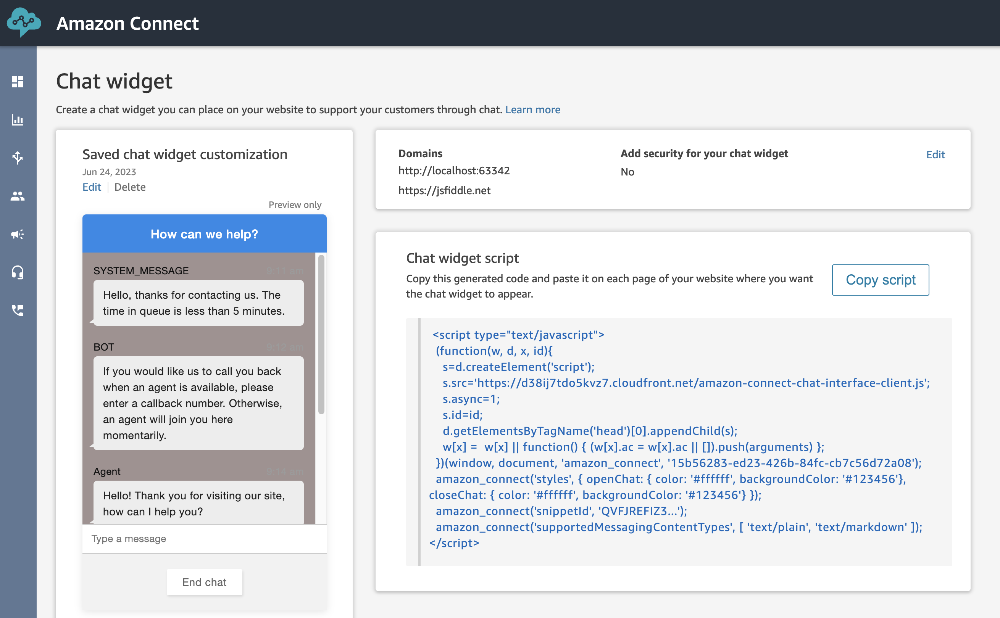
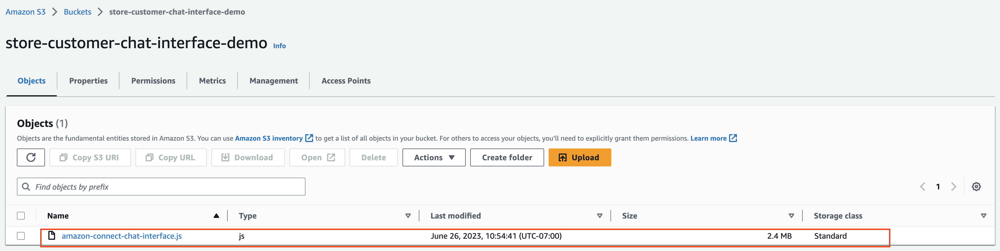
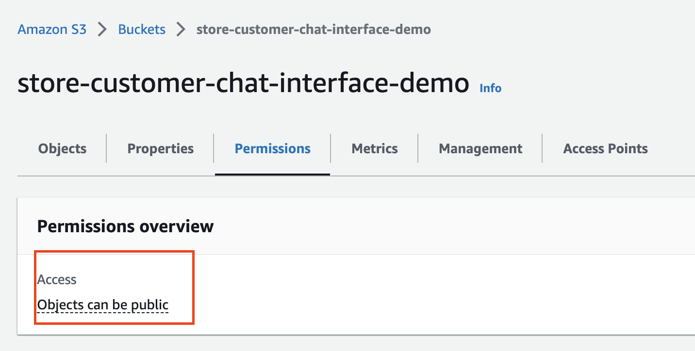
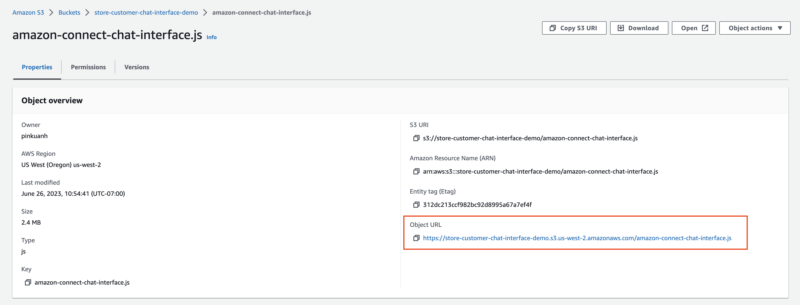
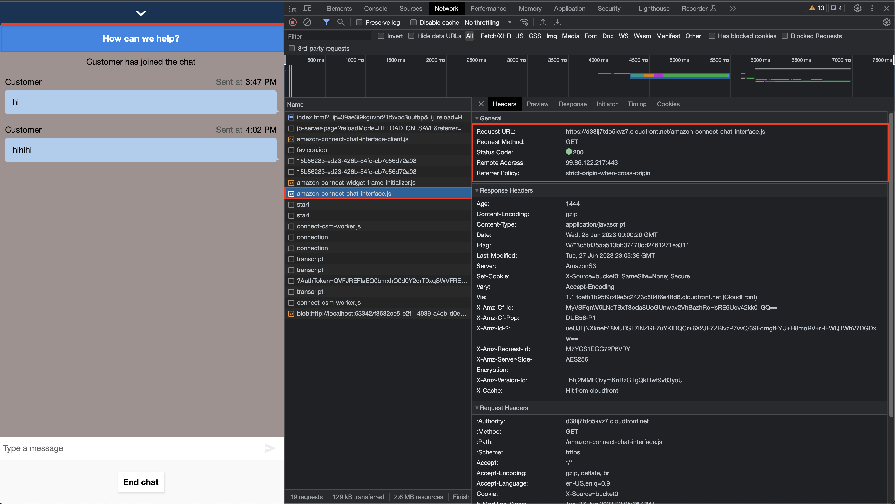
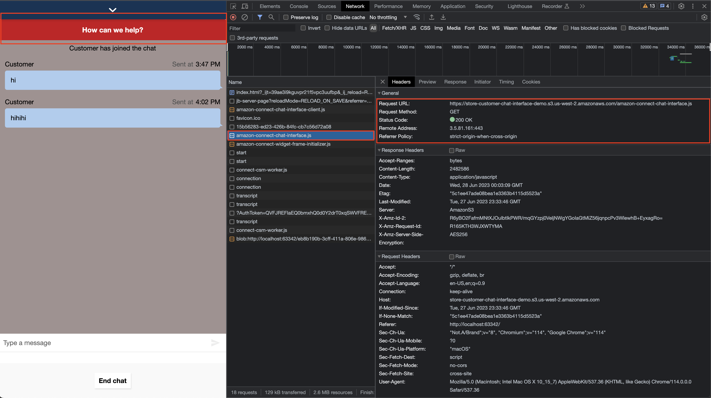

# Use the customized version of amazon-connect-chat-interface.js in a quick way

## Overview
The documentation shows how to access a customized version of `amazon-connect-chat-interface.js` using the Chat Widget script. If your intention is to only customize [amazon-connect-chat-interface.js](https://github.com/amazon-connect/amazon-connect-chat-interface) and use it in your chat widget, you can consider this method as a quick way to do it. If you want to customize [amazon-connect-chat.js](https://github.com/amazon-connect/amazon-connect-chatjs), this method is not suitable. Instead, please follow the setup steps outlined in [this README.md](../README.md) file.

## Setup Guildes
1. If you don't already have a Chat Widget instance in your AWS account, please set one up by following this [AWS Guide](https://docs.aws.amazon.com/connect/latest/adminguide/tutorial1-set-up-your-instance.html).

2. On the Chat Widget Panel, you can see your Chat widget script.


3. You can customize and upload your `amazon-connect-interface.js` file to your own S3 bucket or any storage server. Follow [customize interface.js steps](https://github.com/amazon-connect/amazon-connect-chat-interface/blob/spenlep/improve-readme-documentation/DOCUMENTATION.md#features) to customize `amazon-connect-interface.js`.

    - 3-1. Build your own amazon-connect-chat-interface.js and upload it in your S3 bucket.
    
    - 3-2. Bucket access should be public.
    

4. Now, with just one line of script added to your Chat Widget script, you can use `amazon-conncet-chat-interface.js` in your chat widget.
    - 4-1. Copy the link to customized `amazon-connect-chat-interface.js`.
    

    - 4-2. Use the link as a parameter in the following script. Include this script along with your Chat Widget script and paste it into your website file.

        ```
        amazon_connect('customerChatInterfaceUrl', 'https://...'); # TODO: put in your link to amazon-connect-chat-interface.js
        ```
 
5. You should see the source of `amazon-connect-chat-interface.js` is now your file.

    - Before(using Amazon default `amazon-connect-chat-interface.js`):
     

    - After (using your customized  `amazon-connect-chat-interface.js`):
     