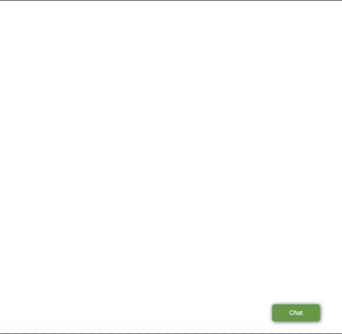
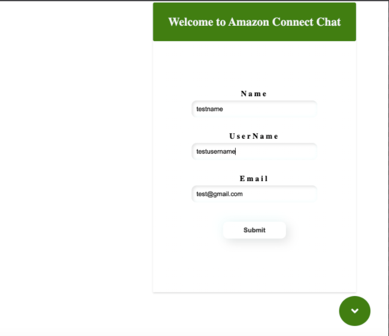
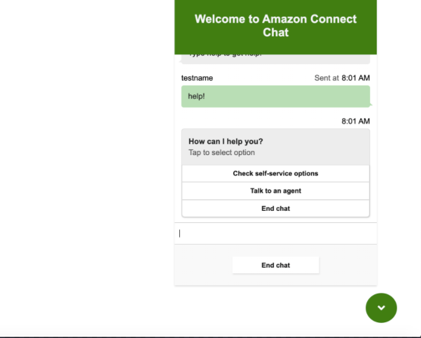

# Custom Chat Widget Usage

## Description

Custom Chat Widget is a JavaScript library that enables you to place a Chat Button (or Icon), Chat Form, and Chat Widget at your website. When this library is imported, using `script` tag in a web page, it exposes `AmazonCustomChatWidget.ChatInterface.init()` method to the global `window` object. This method can be invoked with various properties, to get the Amazon Connect Chat in the website.

Custom Chat Widget library simplifies the process of embedding, styling, and positioning Chat widget, with Chat Form, on your web page. On top of that, you also have a flexibility to customize this library, according to your business requirements.

Below steps explain how Custom Chat Widget works on a web page

1. To enable customers to start a new Chat on your web page, you could either use `ChatIcon` or `ChatButton`.

   Chat Icon:  
   

   Chat Button:  
   

2. When `ChatIcon` (or `ChatButton`) is clicked, `ChatForm` is presented to the customer. The fields in `ChatForm` are customizable.

   

3. When this form is submitted by the customer, Custom Chat Widget opens and starts a new Chat contact, for self service, and/or transfer to a chat agent.

   

## Prerequisites

- Amazon Connect instance, ready to receive chats.  
   [Refer to : Enabling Chat in Existing Amazon Connect Contact Center section in this link](../README.md#enabling-chat-in-an-existing-amazon-connect-contact-center)

- An Amazon Connect Contact Flow, ready to receive chat contacts.  
   [Refer to this link on how to create a Contact Flow for Chat](https://docs.aws.amazon.com/connect/latest/adminguide/chat.html)

- Amazon Connect Chat backend.  
   [Refer to this link on how to deploy the Chat backend](../cloudformationTemplates/asyncCustomerChatUX/README.md)

## Usage

- Import `amazon-connect-chat-interface.js` and `ACChat.js`, using `script` tag in your HTML. Please note that the order of this import is important.

  [amazon-connect-chat-interface.js](public/amazon-connect-chat-interface.js)

  [ACChat.js](public/ACChat.js)

  ```html
  <script src="/amazon-connect-chat-interface.js"></script>
  <script src="/ACChat.min.js"></script>
  ```

- Once `ACChat.js` is imported, it exposes `AmazonCustomChatWidget.ChatInterface.init()` method. This method can be invoked with certain properties, to place Custom Chat Widget on a web page.
- Below description explains each of those properties

  1. `containerId` : Specify a HTML Element ID, where Custom Chat Widget is going to be placed. Preferably, provide the root ID# of the document body.
  2. `initiationIcon`: Can be set as `icon` or `button`.
  3. `region`: Specify the region where Amazon API Gateway was deployed.
  4. `name`: Specify customer's name, which is passed during Chat initiation. This field is mandatory. It can have one of the below values:

     - A variable
     - A constant
     - Refer to the form input field `Name` like this: `refer|inputFields|Name`.

  5. `username`: Specify customer's username, which is passed during Chat initiation. This field is mandatory. It can have one of the below values:

     - A variable
     - A constant
     - Refer to the input field `UserName` like this: `refer|inputFields|UserName`.

  6. `apiGateway`: Provide Amazon API Gateway URL for your Amazon Connect Chat backend, that was deployed using the Cloudformation template. (`https://${apiId}.execute-api.${region}.amazonaws.com/Prod`)

  7. `contactFlowId`: Provide Amazon Connect Contact Flow ID (not full ARN).

     For example: If the Contact flow ARN : `arn:aws:connect:<region>:111111111111:instance/11111111-1111-1111-1111-1111111111/contact-flow/XXXXXX-XXXX-XXXX-XXXX-XXXXXXXXXX`, then the contact flow ID will be `XXXXXX-XXXX-XXXX-XXXX-XXXXXXXXXX`.

  8. `instanceId`: Provide your Amazon Connect Instance ID (not full ARN).

     For example: If the Instance ARN : `arn:aws:connect:<region>:11111111111111:instance/XXXXXX-XXXX-XXXX-XXXX-XXXXXXXXXX` , then the instance ID will be `XXXXXX-XXXX-XXXX-XXXX-XXXXXXXXXX`.

  9. `contactAttr`: This is an object that can have keys and values. Basically, these attributes will be sent to your Contact Flow during chat initiation.

  10. `preChatForm`: This form can be used in identifying your customer, by collecting customer's information, like their name or email. These attributes can also be sent to Amazon Connect Contact Flow, so we don't have to identify the customer again in the bot, and can just proceed with verification. This helps to reduce Average Handle Time (AHT). This field is not mandatory. If not provided, no chat form will be presented to the customer.

      - `visible`: This can set to `true` or `false`.
      - `inputFields`: An array of objects. Each object has `name` and `validation` field. The `name` represents the label of the input field in `ChatForm`, and the `validation` field can be set as `required` or `notrequired`.

      ```js
      preChatForm:{
          visible: true,
          inputFields:[
              {
                  name: "Name",
      		      validation: "required"
              },
              {
                  name: "UserName",
      		      validation: "required"
              },
              {
                  name: "Email",
      		      validation: "notrequired"
              }
          ]
      }

      ```

  11. `primaryColor`: Specify the color of `ChatIcon` or `ChatButton`, then `ChatForm` and `ChatWidget`.

  12. `description`: Specify the description that will be displayed in `ChatWidget`.

- Below is a simple example on how `ACChat` can be invoked in a HTML page:

  [public/index.html](public/index.html)

```html
<!DOCTYPE html>
<html>
	<head>
		<meta charset="UTF-8" />
		<meta name="viewport" content="width=device-width, initial-scale=1.0" />
		<meta http-equiv="X-UA-Compatible" content="ie=edge" />
		<title>Chat</title>
	</head>
	<body>
		<div id="root"></div>
		<script src="/amazon-connect-chat-interface.js"></script>
		<script src="/ACChat.js"></script>
		<script>
			AmazonCustomChatWidget.ChatInterface.init({
				containerId: 'root',
				initiationIcon: 'icon', // icon/button
				region: 'us-east-1',
				name: 'refer|inputFields|Name', // **** Mandatory**** Add a constant or a variable for chat without form or if you have a form then you can refer it to the input fields like "refer|inputFields|Name"
				username: 'refer|inputFields|UserName', // **** Mandatory**** Add a constant or a variable for chat without form or if you have a form then you can refer it to the input fields like "refer|inputFields|UserName"
				apiGateway: 'https://<XXXXXXXXX>.execute-api.us-east-1.amazonaws.com/Prod' /* API Gateway URI */,
				contactFlowId: 'XXXXXX-XXXX-XXX-XXX-XXXXXXX',
				instanceId: 'XXXXXX-XXXX-XXXX-XXXX-XXXXXXXXXX',
				contactAttr: {
					sampleKey1: 'sampleValue1',
					sampleKey2: 'sampleValue2',
				},
				preChatForm: {
					visible: true,
					inputFields: [
						{
							name: 'Name',
							validation: 'required',
						},
						{
							name: 'UserName',
							validation: 'required',
						},
						{
							name: 'Email',
							validation: 'notrequired',
						},
					],
				},
				primaryColor: '#003da5',
				description:
					'Welcome to Chat' /* the description that goes in the header*/,
			});
		</script>
	</body>
</html>
```

## How to customize the widget

- The source code in `/customChatWidget/src` folder can be used to customize `ChatIcon` , `ChatButton` and `ChatForm`.

- In your Terminal, clone the repo: `git clone https://github.com/amazon-connect/amazon-connect-chat-ui-examples.git`

- Go to `/customChatWidget`.

- Run `npm install` to install `node_modules`.

- You can now customize any of the components in `customChatWidget/src/components` according to your business requirements.

- Run `npm run build` to build a production package, using Babel. The build process produces minified `ACChat.js` file, and stores it into `public` folder. Please note that `webpack.dev.js` produces a development version, which includes console logs. For a production build, please use `webpack.prod.js`.

- For testing, run `npm run dev-build` to build a dev package using Babel and `webpack.dev.js` and saves the built minified file into the `public` folder with name `ACChat.js`. The dev version will have console logs.

## Testing

- Once the build has completed, you can test `index.html` in `/customChatWidget/public`, using *Live Server* extension, in case you are using VS Code.

  [VS Code Live Server Extension](https://marketplace.visualstudio.com/items?itemName=ritwickdey.LiveServer)
