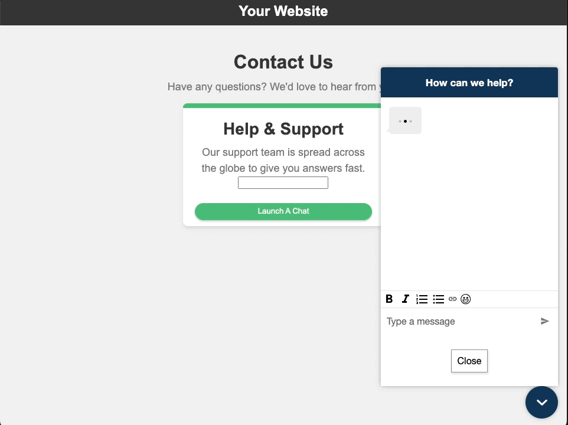

# Hosted Widget Customizations

Additional ways to configure the Amazon Connect Hosted Widget on your website and further personalize the branding.

View the following sample code for customizing the widget. Follow the ["Admin Guide: Add chat to your website"](https://docs.aws.amazon.com/connect/latest/adminguide/add-chat-to-website.html) to get started, and replace the example snippets with your generated `<script>` code.

```html
<!-- EXAMPLE SNIPPET - Edit all "<REPLACE_ME>" values -->
<script type="text/javascript">
  (function (w, d, x, id) {
    s = d.createElement("script");
    s.src =
      "https://<REPLACE_ME>.cloudfront.net/amazon-connect-chat-interface-client.js";
    s.async = 1;
    s.id = id;
    d.getElementsByTagName("head")[0].appendChild(s);
    w[x] =
      w[x] ||
      function () {
        (w[x].ac = w[x].ac || []).push(arguments);
      };
  })(window, document, "amazon_connect", "<REPLACE_ME>");
  amazon_connect("styles", {
    openChat: { color: "#ffffff", backgroundColor: "#07b62a" },
    closeChat: { color: "#ffffff", backgroundColor: "#07b62a" },
  });
  // ALSO: further customize the widget styles: https://docs.aws.amazon.com/connect/latest/adminguide/pass-custom-styles.html
  amazon_connect("snippetId", "<REPLACE_ME>");
  amazon_connect("supportedMessagingContentTypes", [
    "text/plain",
    "text/markdown",
  ]);
  // ALSO: how to pass contact attributes: https://docs.aws.amazon.com/connect/latest/adminguide/pass-contact-attributes-chat.html
  amazon_connect('customerDisplayName', function(callback) {
    const displayName = '<REPLACE_ME>';
    callback(displayName);
  });
</script>
```

## Prerequisites

Looking to add the Amazon Connect Widget to your website? Follow the [Admin Guide documentation](https://docs.aws.amazon.com/connect/latest/adminguide/add-chat-to-website.html)

New to Amazon Connect Open Source? Follow the [open source walkthrough](https://github.com/amazon-connect/amazon-connect-chat-ui-examples/blob/master/.github/docs/AmazonConnectChatOpenSourceWalkthrough.md)

## Examples

### Basic setup

[basicWidgetSetup](./basicWidgetSetup): render Amazon Connect widget button in the lower-right corner of your website.


### Custom widget launch button

[customWidgetLaunchButton](./customWidgetLaunchButton): launch the widget from a button element anywhere on your website.


### Custom floating widget launch icon

[customFloatingWidgetLaunchIcon](./customFloatingWidgetLaunchIcon): launch the widget from a floating icon rendered anywhere on your website.


### Submit form to launch a new chat
[formSubmitLaunchChat](./formSubmitLaunchChat): submit a form to launch a new chat and pass in values as contact attributes.


### Hyperlink support

[hyperlinkSupportWidget](./hyperlinkSupportWidget): support a plain-text URL that launches the widget on page load.


### Load widget assets when button is clicked

[loadAssetsOnButtonClick](./loadAssetsOnButtonClick): improve page load speed by only fetching widget static assets on button click, versus on page load.


### Launch a new chat in a browser window

[launchChatBrowserWindow](./launchChatBrowserWindow): make the widget launch in a new browser window.


### Persistent chat
[persistentChat](./persistentChat): resume previous conversations with the context, metadata, and transcripts.


