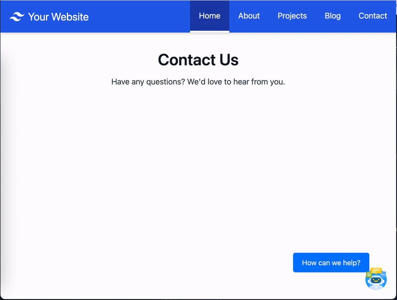

# Custom floating widget launch icon

Launch the widget from a floating icon rendered anywhere on your website.

> Also refer to the Admin Guide documentation: https://docs.aws.amazon.com/connect/latest/adminguide/customize-widget-launch.html



## Setup

1. Render a icon/button element on your website

```html
<div id="launch-div">
  <button id="launch-widget-btn">How can we help?</button>
  
</div>
```

2. Configure the `programmaticLaunch` function (in the widet snippet code)

```js
amazon_connect("customLaunchBehavior", {
  skipIconButtonAndAutoLaunch: true,
  alwaysHideWidgetButton: true,
  programmaticLaunch: function (launchCallback) {
    var launchWidgetBtn = document.getElementById("launch-widget-btn");

    if (launchWidgetBtn) {
      launchWidgetBtn.addEventListener("click", function () {
        launchWidgetBtn.style.display = "none";
        document.getElementById("launch-widget-img").style.display = "none";
        launchCallback();
      });

      window.onunload = function () {
        launchWidgetBtn.removeEventListener("click", launchCallback);
        return;
      };
    }
  },
});
```

## Snippet Customizations

```diff
<script type="text/javascript">
  (function(w, d, x, id){
    s=d.createElement('script');
    s.src='https://<REPLACE>.cloudfront.net/amazon-connect-chat-interface-client.js';
    s.async=1;
    s.id=id;
    d.getElementsByTagName('head')[0].appendChild(s);
    w[x] =  w[x] || function() { (w[x].ac = w[x].ac || []).push(arguments) };
  })(window, document, 'amazon_connect', '<REPLACE>');
  amazon_connect('styles', { openChat: { color: '#ffffff', backgroundColor: '#07b62a'}, closeChat: { color: '#ffffff', backgroundColor: '#07b62a'} });
  amazon_connect('snippetId', '<REPLACE>');
  amazon_connect('supportedMessagingContentTypes', [ 'text/plain', 'text/markdown' ]);
  // ALSO: how to pass contact attributes: https://docs.aws.amazon.com/connect/latest/adminguide/pass-contact-attributes-chat.html
  amazon_connect('customerDisplayName', function(callback) {
    const displayName = '<REPLACE_ME>';
    callback(displayName);
  });
+ amazon_connect('customLaunchBehavior', {
+   skipIconButtonAndAutoLaunch: true,
+   alwaysHideWidgetButton: true,
+   programmaticLaunch: (function (launchCallback) {
+     var launchWidgetBtn = document.getElementById('launch-widget-btn');
+
+     if (launchWidgetBtn) {
+       launchWidgetBtn.addEventListener('click', function () {
+         launchWidgetBtn.style.display = 'none';
+         document.getElementById('launch-widget-img').style.display = 'none';
+         launchCallback();
+       });
+
+       window.onunload = function () {
+         launchWidgetBtn.removeEventListener('click', launchCallback);
+         return;
+       }
+     }
+   }),
+ });
</script>
```
