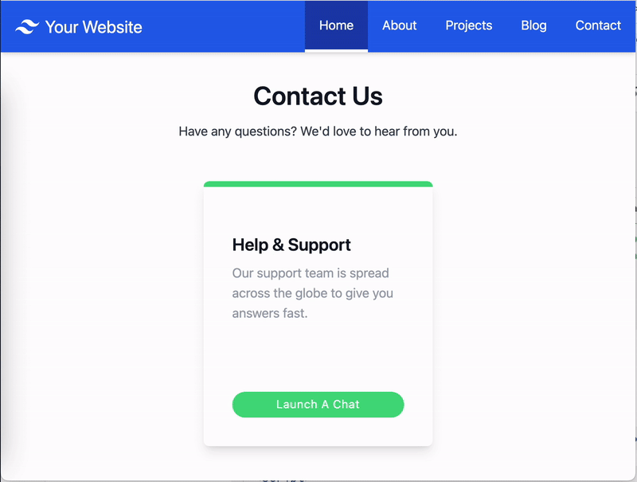

# Launch a new chat in a browser window

Make the widget launch in a new browser window.

This option allows you to launch chat in a new browser window. You can specify window size or launch chat in a new browser tab.

> Also refer to the Admin Guide documentation: https://docs.aws.amazon.com/connect/latest/adminguide/customize-widget-launch.html



## Setup

1. Configure a widget snippet for Hyperlink support, see the [hyperlinkSupportWidget](https://github.com/amazon-connect/amazon-connect-chat-ui-examples/tree/master/hostedWidgetCustomization/hyperlinkSupportWidget) example

2. Render a button element on your website

```html
<button id="launch-widget-btn">Launch a Chat</button>
```

3. Add the event listener to launch new browser window/tab

```html
<script>
  // Function to open a new browser window with specified URL and dimensions
  function openNewWindow() {
    var url = "https://example.com/contact-us-chat";

    // Define the width and height
    var width = 300;
    var height = 540;

    // Calculate the left and top position to center the window
    var left = (window.innerWidth - width) / 2;
    var top = (window.innerHeight - height) / 2;

    // Open the new window with the specified URL, dimensions, and position
    var newWindow = window.open(
      url,
      "",
      "width=${width}, height=${height}, left=${left}, top=${top}",
    );
  }

  // Attach a click event listener to the button
  document
    .getElementById("launch-widget-btn")
    .addEventListener("click", openNewWindow);
</script>
```

4. Click button to launch URL in new browser window/tab: `https://example.com/contact-us-chat`

## Snippet Customizations

Refer to the [hyperlinkSupportWidget](https://github.com/amazon-connect/amazon-connect-chat-ui-examples/tree/master/hostedWidgetCustomization/hyperlinkSupportWidget) example.
