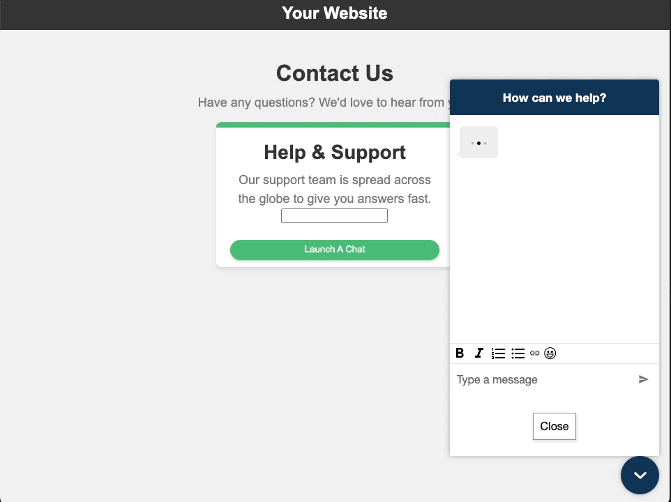

# Persistent Chat

Resume previous conversations with the context, metadata, and transcripts.

Customers don't need to repeat themselves when return to a chat, and agents have access to the entire conversation history.

> Also refer to the Admin Guide documentation: https://docs.aws.amazon.com/connect/latest/adminguide/chat-persistence.html



## Setup

1. Pass contactId in the contact attributes to the payload of your JWT, see the [contact attributes in JWT payload](https://docs.aws.amazon.com/connect/latest/adminguide/pass-contact-attributes-chat.html#how-to-contact-attributes-chatwidget) example

2. [Create persistent contact association flow block](https://docs.aws.amazon.com/connect/latest/adminguide/create-persistent-contact-association-block.html)

3. Add `contactMetadataHandler` callback to your widget snippet to access contactId.

4. Render a button element on your website

```html
<button id="launch-widget-btn">Launch a Chat</button>
```

```html
<script>
  var buttonElem = document.getElementById("launch-widget-btn");

  buttonElem.addEventListener("click", function () {
    (function (w, d, x, id) {
      s = d.createElement("script");
      s.src =
        "https://<REPLACE_ME>.cloudfront.net/amazon-connect-chat-interface-client.js";
      s.async = 1;
      s.id = id;
      d.getElementsByTagName("head")[0].appendChild(s);
      w[x] =
        w[x] ||
        function () {
          (w[x].ac = w[x].ac || []).push(arguments);
        };
    })(window, document, "amazon_connect", "<REPLACE_ME>");
    amazon_connect("styles", {
      openChat: { color: "#000", backgroundColor: "#3498fe" },
      closeChat: { color: "#fff", backgroundColor: "#123456" },
    });
    amazon_connect("snippetId", "<REPLACE_ME");
    amazon_connect("customLaunchBehavior", {
      skipIconButtonAndAutoLaunch: true,
    });
    amazon_connect('contactMetadataHandler', (metadata) => {
       // access contactId from metadata e.g. metadata.chatContactId
       // To experinece chat persistence store the contact ID and use it when initiating a new chat.
    });
  });
</script>
```

5. Now initiate a new chat and engage in a conversation with the agent. Once you've completed the conversation, terminate the chat. After waiting for at least one minute, reinitiate a new chat session using the same contact ID from the previous conversation. Upon doing so, you will have access to the previous chat history, allowing you to continue the conversation seamlessly.

## Snippet Customizations

```diff
<script type="text/javascript">
  (function(w, d, x, id){
    s=d.createElement('script');
    s.src='https://<REPLACE_ME>.cloudfront.net/amazon-connect-chat-interface-client.js';
    s.async=1;
    s.id=id;
    d.getElementsByTagName('head')[0].appendChild(s);
    w[x] =  w[x] || function() { (w[x].ac = w[x].ac || []).push(arguments) };
  })(window, document, 'amazon_connect', '<REPLACE_ME>');
  amazon_connect('styles', { openChat: { color: '#ffffff', backgroundColor: '#07b62a'}, closeChat: { color: '#ffffff', backgroundColor: '#07b62a'} });
  amazon_connect('snippetId', '<REPLACE_ME>');
  amazon_connect('supportedMessagingContentTypes', [ 'text/plain', 'text/markdown' ]);
  // ALSO: how to pass contact attributes: https://docs.aws.amazon.com/connect/latest/adminguide/pass-contact-attributes-chat.html
  amazon_connect('customerDisplayName', function(callback) {
    const displayName = '<REPLACE_ME>';
    callback(displayName);
  });
+ amazon_connect('contactMetadataHandler', (metadata) => {
+   // do something with metadata.chatContactId
+ });
</script>
```