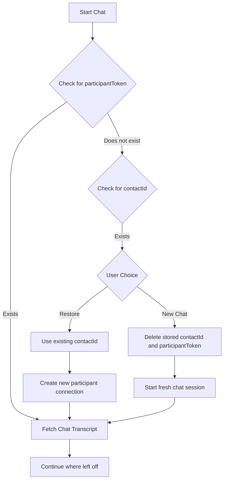

# Android Native Chat Demo 📱

A native android example app for building custom Amazon Connect Chat. This solution implements basic [ChatWidget](https://docs.aws.amazon.com/connect/latest/adminguide/add-chat-to-website.html) functionality and is capable of Interactive Messages.

> Refer to [#Specifications](#speficications) for details on compatibility, supported versions, and platforms.

**Reference:**

- Documentation: https://docs.aws.amazon.com/connect/latest/adminguide/enable-chat-in-app.html

https://github.com/amazon-connect/amazon-connect-chat-ui-examples/assets/143978428/1298b153-f476-48d8-aa36-605f3642103a

## Contents

- [Prerequisites](#prerequisites)
- [Local Development](#local-development)
- [How is it working?](#how-is-it-working)


## Prerequisites

- Create an Amazon Connect Instance [[guide](https://docs.aws.amazon.com/connect/latest/adminguide/amazon-connect-instances.html)]
    - OR: enable chat experience for an existing Connect instance. [[guide](../../README.md#enabling-chat-in-an-existing-amazon-connect-contact-center)]

- Create an Amazon Connect Contact Flow, ready to receive chat contacts. [[guide](https://docs.aws.amazon.com/connect/latest/adminguide/chat.html)]

    - Note the `instanceId` [[guide](https://docs.aws.amazon.com/connect/latest/adminguide/find-instance-arn.html)]
    - Find the `contactFlowId` for the ["Sample Inbound Flow (First Contact)"](https://docs.aws.amazon.com/connect/latest/adminguide/sample-inbound-flow.html) [[guide](https://docs.aws.amazon.com/connect/latest/adminguide/find-contact-flow-id.html)]

- Deploy a custom Amazon Connect Chat backend. [Refer to this backend template](../../cloudformationTemplates/startChatContactAPI/README.md)

    - Deploy a StartChatContact template Lambda [[CloudFormation Template](https://github.com/amazon-connect/amazon-connect-chat-ui-examples/tree/master/cloudformationTemplates/startChatContactAPI)]
    - Add the `region`, `API_GATEWAY_ID`, `contactFlowId`, and `instanceId` to `endpoints.js`.


## Local Development

> #️⃣ Versions: Android Studio Giraffe, Kotlin 1.9.20
<br>⬇️ Download Android Studio : https://developer.android.com/studio

1. Clone this repository: https://github.com/amazon-connect/amazon-connect-chat-ui-examples/tree/master/
    ```sh
    $ git clone https://github.com/amazon-connect/amazon-connect-chat-ui-examples.git
    ```
2. Launch Android Studio and in the project directory open `AndroidChatExample` and let the indexing be finished.
3. Make sure there are no errors after initial gradle build.
4. Edit the Config file with your instance details as generated in [Prerequisites](#prerequisites)
    > While setting up Config's startChatEndpoint Please, remove `Prod/` from your url, as it is appended later in `ApiInterface.kt`

   > Make sure you have Androis Simulator added [Guide: [Adding Android Emulator]](https://developer.android.com/studio/run/managing-avds)

5. Once everything looks okay, Run the app by clicking on ▶️ button `Control + R`or`^ + R`.

## How is it working?

### ChatViewModel
It is responsible for managing the chat state, including initiating the chat, sending and receiving messages, and closing the chat connection when done.

- **Managing Messages**: It holds an array of Message objects, which are published to the UI to reflect real-time chat updates.
- **Handling WebSockets**: ChatViewModel integrates with WebsocketManager to manage WebSocket connections for real-time message delivery.

#### Initialization:
Upon instantiation, ChatViewModel sets up necessary configurations and prepares the AWS Connect Participant client.
- **Chat Initiation**:
  When initiateChat is called, it ensures that a WebSocket URL is available, then creates a WebSocket manager instance that listens for incoming messages and events.
- **Message Handling**:
  onMessageReceived processes incoming messages and updates the UI accordingly. It filters out typing indicators and handles message status updates (e.g., delivered, read).
- **Chat API Calls**:
  The view model interacts with ChatRepository to API calls to start chat sessions (startChatContact), create participant connections (createParticipantConnection), and send messages or events (sendChatMessage, sendEvent).

### ChatRepository
- **Interfacing with AWS Services**: Makes HTTP calls and Utilizes the AWS Connect Participant Service to register a participant and establish a chat session.

### WebsocketManager:
The WebsocketManager handles the WebSocket connection lifecycle and receives chat messages and other events.

- **WebSocket Connection**:
  Manages the WebSocket connection, handling connect and disconnect events, and transmitting chat messages.
- **Receiving Messages**:
  Implements the didReceive method to handle different WebSocket events, such as incoming text messages that are then passed to the messageCallback.
- **Connection**:
  Connects to the WebSocket using the provided URL and listens for events.
- **Event Handling**:
  On receiving events, it delegates processing to the appropriate handlers, for instance:
  Messages are processed and passed to ChatViewModel through the messageCallback.
  Connection status changes are logged, and isConnected status is updated.
- **Message Distribution**:
  Incoming text messages are deserialized and depending on their type (MESSAGE, EVENT, etc.), appropriate actions are taken, such as updating UI or acknowledging message receipt.
- **websocketDidConnect**: Called when the WebSocket connects, and may subscribe to topics if necessary.
- **websocketDidReceiveMessage**: Parses and handles incoming messages, delegating them back to ChatManager for UI updates.


### Chat Rehydration

Chat rehydration is a feature that allows users to continue their previous chat sessions. This process involves several checks and actions:

- **Check for Participant Token:**
  On initiating chat, the module first checks if a `participantToken` exists.
  - If it exists, the module proceeds to fetch the chat transcript, allowing the user to continue from where they left off.
  - If it does not exist, the module then checks for a `contactId`.

- **Use of Contact ID:**
  If a `contactId` exists, the module prompts the user to either restore the previous session or start a new chat.
  - If the user chooses to restore, the module starts a new chat session with the existing `contactId`, creates a new participant connection, and then fetches the transcript.
  - If the user opts for a new chat, the module deletes the stored `contactId` and `participantToken` from the storage, ensuring a fresh start. The chat begins with no prior context, emulating the start of a new conversation.

      > There will be a new `initialContactId` when chat is rehydrated. The existing `contactId` will only be used as the `sourceContactId`. You may need to use the new `initialContactId` for the `CreateParticipantConnection` call or other APIs if you want to operate on the new contact.

- **Deleting Stored Values:**
  For users who opt to start a new chat, the module ensures that previous session identifiers are cleared. This action prevents any overlap or confusion between different chat sessions. By removing the `participantToken` and `contactId`, the ChatViewModel guarantees that the new chat session does not carry over any data or context from previous sessions.



Sample demo:

https://github.com/amazon-connect/amazon-connect-chat-ui-examples/assets/143978428/ae078271-2699-4bae-b04a-503a3ac1bfdd

## Specifications

### Technical Specifications

- Language: Kotlin 1.9.20
- Gradle: 8.1.2
- Android Studio Giraffe
- Android: SDK 24 and Higher (⚠️ Required)
- Frameworks:
    - Jetpack Compose: For UI components and layout.
    - AWS Connect Participant SDK to send events and messages.
- Networking: Utilizing OkHTTP retrofit client for network calls.

### Code Quality

- MVVM Architecture: Separation of concerns between the view, model and repository.
- Reusable Components: Modular design with reusable views and components.
- Error Handling: Comprehensive error handling for networking and data persistence.
- State Management and Dependency Injection: Use of Lifecycle Livedata and hilt to manage the state and increase re-usability of data objects.
