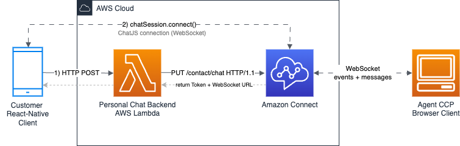
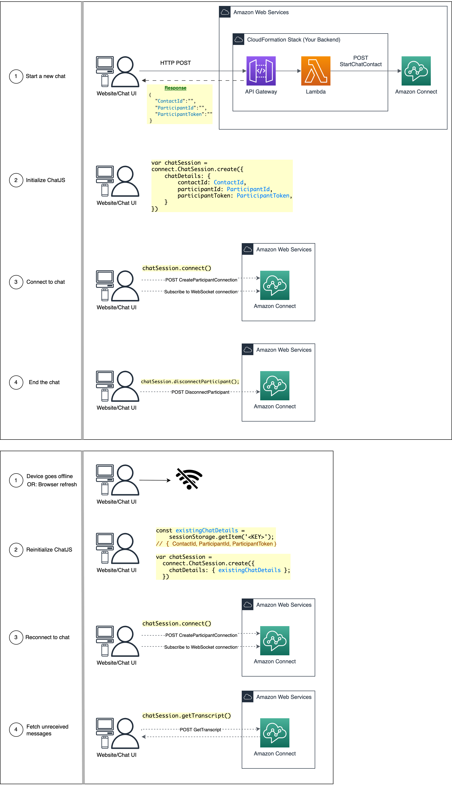

# ChatJS React Native Demo App (Expo)

A React Native starter app for implementing a customer-facing chat UI using Amazon Connect's [ChatJS](https://github.com/amazon-connect/amazon-connect-chatjs) library. Offers out-of-the-box WebSocket management and simplified Amazon Connect API integration.

> ⚠️ This demo code is for example purposes only and should not be used in production without updating dependencies.

<!-- Screen recording -->
https://github.com/user-attachments/assets/4f6e304e-51c2-45d3-b770-f7507174e40b



## Quick Links

- [Prerequisites](#prerequisites)
- [Getting Started](#getting-started)
- [End-to-end Testing](#end-to-end-testing)
- [ChatJS Documentation](#chatjs-documentation)
- [Components](#components)
- [Additional Features](#additional-features)
- [Troubleshooting](#troubleshooting)

## Prerequisites

- An [AWS Account](https://aws.amazon.com/console/)
- An Amazon Connect instance (`instanceId`) - [Create an Amazon Connect instance](https://docs.aws.amazon.com/connect/latest/adminguide/amazon-connect-instances.html)
- An Amazon Connect Contact Flow (`contactFlowId`, ["Sample inbound flow"](https://docs.aws.amazon.com/connect/latest/adminguide/sample-inbound-flow.html) recommended)
- **Node.js** installed on your machine `>= v18` ([Download here](https://nodejs.org/en/download))
- **Proxy Backend**: you'll need to host a proxy backend, deploy this use CloudFormation template: [startChatContactAPI](https://github.com/amazon-connect/amazon-connect-chat-ui-examples/tree/master/cloudformationTemplates/startChatContactAPI)
- _(Optional) Android Studio Emulator installed on local machine [docs: [Expo Android Emulator installation](https://docs.expo.dev/workflow/android-studio-emulator/)]_
- _(Optional) iOS Simulator installed on local machine [docs: [Expo iOS Simulator installation](https://docs.expo.dev/workflow/ios-simulator/)]_

## Getting Started

1. Clone the repository

```sh
git clone https://github.com/amazon-connect/amazon-connect-chat-ui-examples.git
cd amazon-connect-chat-ui-examples
cd mobileChatExamples/connectReactNativeChat
```

2. Install dependencies

```sh
npm install
```

3. Deploy the proxy backend, using this CloudFormation template [startChatContactAPI](https://github.com/amazon-connect/amazon-connect-chat-ui-examples/tree/master/cloudformationTemplates/startChatContactAPI). This will make the [StartChatContact](https://docs.aws.amazon.com/connect/latest/APIReference/API_StartChatContact.html) API request.

4. Add the public endpoint URL for your proxy backend

```js
// src/ChatContext.js

const PROXY_API_ENDPOINT = 'https://${apiId}.execute-api.${region}.amazonaws.com/Prod';
const AWS_REGION = 'us-west-2';
```

5. Configure ChatJS WebSocket manager

This step is already provided in the demo app, feel free to skip to the next section.

ChatJS relies on browser's `window.navigator.onLine` for network monitoring, which isn't available in React Native (Hermes JS Engine). Instead, you'll need to configure ChatJS to use React Native's NetInfo API for network status checks.

> 📌 Important: ensure you are using `amazon-connect-chatjs >= v1.5.0`

```diff
// MyComponents.jsx

import React, { createContext, useContext, useState, useCallback, useMemo, useEffect } from 'react';
import "amazon-connect-chatjs"; // >= v1.5.0 - imports the "window.connect" class
import NetInfo, { useNetInfo } from '@react-native-community/netinfo';

const MyComponent = () => {
  useEffect(() => {
+   window.connect.ChatSession.setGlobalConfig({
+       webSocketManagerConfig: {
+         isNetworkOnline: async () => {
+           const state = await NetInfo.fetch();
+           return state.isConnected;
+         }
+       }
+     });

      // Your proxy backend makes StartChatContact API request: https://docs.aws.amazon.com/connect/latest/APIReference/API_StartChatContact.html
      // Boilerplate backend: https://github.com/amazon-connect/amazon-connect-chat-ui-examples/tree/master/cloudformationTemplates/startChatContactAPI
     const startChatResponse = await fetch('url-to-my-chat-backend').then(response => response.data);

      // Initialize ChatJS session
      const chatSession = window.connect.ChatSession.create({
      chatDetails: {
        contactId: startChatResponse.ContactId,
        participantId: startChatResponse.ParticipantId,
        participantToken: startChatResponse.ParticipantToken,
      },
      options: { region: AWS_REGION },
      type: "CUSTOMER",
      disableCSM: true // CSM is an internal feature, safe to disable
    })

    // Connect to chat session WebsSocket connection
    await chatSession.connect();
  }, [])
}
```

6. Configure polyfills for missing Web APIs in React Native environment.

For `amazon-connect-chatjs >= v3.0.3`, you need to configure polyfills to support certain Web APIs. These include:
 * Crypto
 * ReadableStream
 * TextEncoding
 * ArrayBuffer

If you're using the demo app, you can skip this step. The necessary polyfill configuration is already included in the  `src/polyfills.js` file.

However, if you're building a React Native application that relies on ChatJS, you'll need to set up these polyfills yourself.

7. Run locally

```sh
# run on http://localhost:PORT
$ npm run web
```

```sh
# run on local iOS Simulator (XCode)
$ npm run ios
```

```sh
# run on local Android Emulator (Android Studio)
$ npm run android
```

```sh
# run on device plugged into laptop
$ npx expo run:ios -d
```

## End-to-end testing

1. Launch the demo app on your local machine/device
2. Start a chat session from the demo app
3. Launch the Agent Chat UI, Contact Control Panel (CCP):  https://<instance-alias>.my.connect.aws/ccp-v2
4. Accept the incoming chat contact, send messages end-to-end

> Ensure you have access to Agent CCP, ask your Amazon Connect admin to give you the following permission:
> - **Security Profile**: `"CCP: Access CCP"`

## ChatJS Documentation

Please refer to the ChatJS README: https://github.com/amazon-connect/amazon-connect-chatjs



## Components

ChatScreen includes these main components:

- `initiateChat.js`: handles HTTP request to your personal chat backend
- `ChatSession.js`: low-level abstraction on top of ChatJS
- `ChatWrapper.js`: manages chat state at the UI level, handling loading/disconnect
- `ChatWidget.js`: renders chat composer and transcript

## Additional Features

### Interactive Messages

To enhance your chat experience, you can integrate a Lambda function and render picker elements.

Deploy the boilerplate setup here: https://github.com/amazon-connect/amazon-connect-chat-ui-examples/tree/master/samTemplates/amazon-connect-interactive-messages-example-lex-v2

All available templates are outlined in the docs here: https://docs.aws.amazon.com/connect/latest/adminguide/interactive-messages.html#quick-reply-template

### Attachments

To support file attachments (e.g. images, PDF) in chat, follow these steps:

1. Enable attachments feature for your Amazon Connect Instance [guide: [Enable attachments](https://docs.aws.amazon.com/connect/latest/adminguide/enable-attachments.html)]

2. Upload attachment files with [chatSession.sendAttachment()](https://github.com/amazon-connect/amazon-connect-chatjs?tab=readme-ov-file#chatsessionsendattachment) and

```js
await chatSession.sendAttachment({
  attachment: attachment // type: File [HTML file object, see https://developer.mozilla.org/en-US/docs/Web/API/File]
  metadata: { foo: "bar" }, // optional
});
// supported files: .csv, .doc, .docx, .jpeg, .jpg, .pdf, .png, .ppt, .pptx, .txt, .wav, .xls, .xlsx
// max size: 20MB
// source: https://docs.aws.amazon.com/connect/latest/adminguide/feature-limits.html#feature-limits-chat

// Example usage
var input = document.createElement('input');
input.type = 'file';
input.addEventListener('change', (e) => {
  const file = e.target.files[0];
  chatSession.sendAttachment({ attachment: file })
});
```

3. Handle incoming attachment messages and download with [chatSession.downloadAttachment()](https://github.com/amazon-connect/amazon-connect-chatjs?tab=readme-ov-file#chatsessiondownloadattachment)

```js
chatSession.onMessage(event => {
  const { chatDetails, data } = event;
  const {
    ContentType, // string - 'application/pdf' | 'image/png' | 'text/csv' | 'video/mp4' ...
    Content
    } = data;

  const { AttachmentId, AttachmentName } = Content;
  const attachment = await chatSession.downloadAttachment(AttachmentId);
  // ...
});
```

### Persistent Chat

Persistent Chat allows you to start a new chat sesion and rehydrate the entire previous chat conversation with the context, metadata, and transcripts carried forward. They don't need to repeat themselves when they return to a chat, and agents have access to the entire conversation history.

Each chat session has an associated `ContactId`. This can be used in passed with the StartChatContact API request.

To implement this, please refer to the official documentation ["Admin guide: Enable persistent chat"](https://docs.aws.amazon.com/connect/latest/adminguide/chat-persistence.html)

```js
PUT /contact/chat HTTP/1.1
Content-type: application/json
{
   "Attributes": {
      "string" : "string"
   },
   "ContactFlowId": "string",
   "InitialMessage": {
      "Content": "string",
      "ContentType": "string"
   },
   "InstanceId": "string",
   ... // other chat fields

   // NEW Attribute for persistent chat
   "PersistentChat" : {
       "SourceContactId":"2222222-aaaa-bbbb-2222-222222222222222"
       "RehydrationType":"FROM_SEGMENT"
   }
}
```

### Chat Bot

- AWS Docs: [Add an Amazon Lex bot to Amazon Connect](https://docs.aws.amazon.com/connect/latest/adminguide/amazon-lex.html)
- AWS Docs: [Create conversational AI bots in Amazon Connect](https://docs.aws.amazon.com/connect/latest/adminguide/connect-conversational-ai-bots.html)
- AWS Blog: [Make your Amazon Connect chat experience more engaging with custom participants and generative AI-powered chatbots](https://aws.amazon.com/blogs/contact-center/make-your-amazon-connect-chat-experience-more-engaging-with-custom-participants-and-generative-ai-powered-chatbots/)

## Troubleshooting

### Enable ChatJS logging

```js
// ChatSession.js

class ChatJSClient {
  constructor() {
    // ...

    window.connect.ChatSession.setGlobalConfig({
      // loggerConfig: { useDefaultLogger: false }, // DISABLE
      loggerConfig: { useDefaultLogger: true }, // ENABLE
    });
  }
}
```

### Launch Expo DevTools Debugger

- Physical device: 👋 shake it.
- iOS simulator: Cmd-Ctrl-Z in macOS.
- Android emulator: Cmd-M in macOS or Ctrl-Min Windows.

### WebSocket Not Working on Android Device

Ensure you have enable permissions to allow WebSocket connections.

For SDK version >= 23, Android requires the following line in `AndroidManifest.xml`:

```xml
<uses-permission
    android:name="android.permission.ACCESS_NETWORK_STATE"
/>
```

### Connection Management

```js
chatSession.onConnectionLost(async () => {
  console.log('Websocket lost connection');
  // Implement reconnection logic
  await chatSession.connect();
});

chatSession.onConnectionEstablished(() => {
  console.log('WebSocket connection has been established/reestablished');
});

chatSession.onConnectionBroken(event => {
  console.log('WebSocket connection is broken or terminated');
});
```

### Handling Out-of-Order WebSocket Messages

ChatJS delivers messages in the order they are received, which may not match their actual timestamp order. You'll need to manually sort messages using their timestamps and filter duplicates by ID.

```js
const response = await chatSession.getTranscript({
    scanDirection: "BACKWARD",
    sortOrder: "ASCENDING",
    maxResults: 15
});

const { Transcript } = response.data;
Transcript.forEach(message => {
    const timestamp = new Date(message.AbsoluteTime).toLocaleTimeString();
    const id = message.Id;
    // Sort messages by timestamp and filter duplicates using message ID
});
```

### Messages Not Received During Network Disconnection

If a chat participant loses network connection during a session, the client may fail to receive WebSocket messages.

ChatJS requires manually calling `chatSession.getTranscript()` to fetch missed messages after reconnecting.

```js
// Fetch any missed messages by retrieving the recent transcript
chatSession.onConnectionEstablished(() => {
    console.log('WebSocket connection has been established/reestablished');

    // Get recent messages including any that were missed while offline
    const response = await chatSession.getTranscript({
        scanDirection: "BACKWARD",
        sortOrder: "ASCENDING",
        maxResults: 15
    });

    const { Transcript } = response.data;
    // ... filter and render the updated transcript
});
```

### CSM not initialized

Client-side-metric (CSM) is an internal feature. This functionality is enabled by default but completely safe to disable.

```log
ChatJS-csmService: Failed to addCountAndErrorMetric csm:  ReferenceError: Property 'csm' doesn't exist undefined

ChatJS-csmService: Failed to addLatencyMetric csm:  ReferenceError: Property 'csm' doesn't exist undefined

addCSMCountMetric: CSM not initialized TypeError: Cannot read properties of null (reading 'Metric')
```

**Fix:**

```js
connect.ChatSession.create({
  // ...
  disableCSM: true
})
```

## License

This project is made available under the MIT-0 license. See the [LICENSE](./LICENSE) file.

Copyright Amazon.com, Inc. or its affiliates. All Rights Reserved.


<!--
# React Native + ChatJS Demo

A demo [Expo](https://expo.dev/) app for building custom Amazon Connect Chat in React Native. This cross-platform (Android, iOS, macOS, Windows, & Web) solution implements basic ChatJS functionality and is fully customizable.

> Refer to [#Specifications](#speficications) for details on compatibility, supported versions, and platforms.

**Reference:**

- ChatJS Repository: https://github.com/amazon-connect/amazon-connect-chatjs
- NPM package: https://www.npmjs.com/package/amazon-connect-chatjs
- Documentation: https://docs.aws.amazon.com/connect/latest/adminguide/enable-chat-in-app.html

https://github.com/amazon-connect/amazon-connect-chat-ui-examples/assets/60903378/8887f54a-c121-4246-8981-23d05dd9fa01

## Contents

- [Prerequisites](#prerequisites)
- [Mobile Support](#mobile-support)
- [Local Development](#local-development)
- [Production Build](#production-build)
- [ChatJS Usage](#chatjs-usage)

## Prerequisites

- Create an Amazon Connect Instance [[guide](https://docs.aws.amazon.com/connect/latest/adminguide/amazon-connect-instances.html)]
  - OR: enable chat experience for an existing Connect instance. [[guide](../README.md#enabling-chat-in-an-existing-amazon-connect-contact-center)]

- Create an Amazon Connect Contact Flow, ready to receive chat contacts. [[guide](https://docs.aws.amazon.com/connect/latest/adminguide/chat.html)]

    - Note the `instanceId` [[guide](https://docs.aws.amazon.com/connect/latest/adminguide/find-instance-arn.html)]
    - Find the `contactFlowId` for the ["Sample Inbound Flow (First Contact)"](https://docs.aws.amazon.com/connect/latest/adminguide/sample-inbound-flow.html) [[guide](https://docs.aws.amazon.com/connect/latest/adminguide/find-contact-flow-id.html)]

- Deploy a custom Amazon Connect Chat backend. [Refer to this backend template](../cloudformationTemplates/startChatContactAPI/README.md)

    - Deploy a StartChatContact template Lambda [[CloudFormation Template](https://github.com/amazon-connect/amazon-connect-chat-ui-examples/tree/master/cloudformationTemplates/startChatContactAPI)]
    - Add the `region`, `API_GATEWAY_ID`, `contactFlowId`, and `instanceId` to `endpoints.js`.

## Mobile Support

Additional configuration is required to support ChatJS in React Native applications. UUse `amazon-connect-chatjs@^1.5.0` and apply the changes below:

Install the supported ChatJS library using either Yarn:

```sh
$ yarn add amazon-connect-chatjs@^1.5.0
```

or npm:

```sh
$ npm install amazon-connect-chatjs@^1.5.0
```


#### Override Browser Network Health Check

If running ChatJS in a mobile React Native environment, override the default network setting online and check:

> `amazon-connect-websocket-manager.js` depencency will use `navigator.onLine`. Legacy browsers will always return `true`, but unsupported or mobile runtime will return `null/undefined`.

```js
/**
 * `amazon-connect-websocket-manager.js` depencency will use `navigator.onLine`
 * Unsupported or mobile runtime will return `null/undefined` - preventing websocket connections
 * Legacy browsers will always return `true` [ref: caniuse.com/netinfo]
 */
const customNetworkStatus = () => true;

connect.ChatSession.setGlobalConfig({
  webSocketManagerConfig: {
    isNetworkOnline: customNetworkStatus, // default: () => navigator.onLine
  }
});
```

#### Custom Network Health Check

Extending this, device-native network health checks can be used for React Native applications.

1. First, install the `useNetInfo` react hook:

```sh
$ npm install --save @react-native-community/netinfo
# source: https://github.com/react-native-netinfo/react-native-netinfo
```

2. Make sure to update permissions, Android requires the following line in `AndroidManifest.xml`: (for SDK version after 23)

```xml
<uses-permission
    android:name="android.permission.ACCESS_NETWORK_STATE"
/>
```

3. Set up the network event listener, and pass custom function to `setGlobalConfig`:

> Note: To configure `WebSocketManager`, `setGlobalConfig` must be invoked

```js
import ChatSession from "./ChatSession";
import NetInfo from "@react-native-community/netinfo";
import "amazon-connect-chatjs"; // ^1.5.0 - imports global "connect" object

/**
 * By default, `isNetworkOnline` will be invoked every 250ms
 * Should only current status, and not make `NetInfo.fetch()` call
 *
 * @return {boolean} returns true if currently connected to network
*/
let isOnline = true;
const customIsNetworkOnline = () => isOnline;

const ReactNativeChatComponent = (props) => {
  /**
   * Network event listener native to device
   * Will update `isOnline` value asynchronously whenever network calls are made
  */
  const unsubscribeNetworkEventListener = NetInfo.addEventListener(state => {
    console.log('NetInfo eventListener - isConnected:',  state.isConnected);
    isOnline = state.isConnected;
  });
  useEffect(() => {
    return unsubscribeNetworkEventListener();
  }, []);
  const initializeChatJS = () => {
    // To configure WebSocketManager, setGlobalConfig must be invoked
    connect.ChatSession.setGlobalConfig({
      // ...
      webSocketManagerConfig: {
        isNetworkOnline: customIsNetworkOnline, // default: () => navigator.onLine
      }
    });
  }
  // ...
}
```

4. Optionally, this configuration can be dynamically set based on the `Platform`

```js
import { Platform } from 'react-native';
const isMobile = Platform.OS === 'ios' || Platform.OS === 'android';
connect.ChatSession.setGlobalConfig({
  // ...
  webSocketManagerConfig: {
    ...(isMobile ? { isNetworkOnline: () => true } : {}), // use default behavior for browsers
  }
});
```

## Local Development

> Versions: Expo@~48.0.6, react-native@0.71.3, react-native-gifted-chat@^2.0.0, react@^18.2.0
> Supported in Node v16+

> Setting up Android Emulator: https://docs.expo.dev/workflow/android-studio-emulator/
> Setting up iPhone Emulator: https://docs.expo.dev/workflow/ios-simulator/

1. Deploy startChatContact backend (from CFN stack): https://github.com/amazon-connect/amazon-connect-chat-ui-examples/tree/master/cloudformationTemplates/startChatContactAPI

```sh
$ cp endpoints.sample.js endpoints.js
```

```js
// <rootDir>/endpoints.js

export const GATEWAY = {
  region: "us-west-2",
  apiGWId: "asdfasdf",
};

const ENDPOINTS = {
  contactFlowId: "asdf-5056-asdf-a672-asdf6a81ca6",
  instanceId: "asdf-078b-asdf-9264-asdf98f3c28",
  region: GATEWAY.region,
  apiGatewayEndpoint: `https://${GATEWAY.apiGWId}.execute-api.${GATEWAY.region}.amazonaws.com/Prod`,
  ccpUrl: "https://<instanceAlias>.my.connect.aws/ccp-v2", // optional - for reference
};

export default ENDPOINTS;
```

2. Customize several global settings in the `config.js` file, including the `startChatRequestInput` request body.

```js
// <rootDir>/config.js

// Enable/disable ChatJS event logs
export const ENABLE_CHATJS_LOGS = false;

// Renders pop-up on device emulator screen from console.logs
export const ENABLE_REACTNATIVE_LOGBOX = false;

// Enable rich messaging, CCP sends "text/markdown" by default
// doc: https://docs.aws.amazon.com/connect/latest/APIReference/API_StartChatContact.html#API_StartChatContact_RequestSyntax
export const supportMessageContentTypes = ["text/plain"];

export const CUSTOMER_USER = {
  _id: 1,
  name: "Customer",
  avatar: "https://i.pravatar.cc/100?img=11",
};

export const AGENT_USER = {
  _id: 2,
  name: "Agent",
  avatar:
    "https://www.bcbswy.com/wp-content/uploads/2020/05/20.06.26_bcbswy_avatar_@2.0x.png",
};

export const startChatRequestInput = {
  ...ENDPOINTS,
  name: "John",
  contactAttributes: JSON.stringify({
    customerName: "John",
  }),
  supportedMessagingContentTypes: supportMessageContentTypes.join(","),
};
```

3. Run the Expo demo application on an emulator

```sh
$ yarn
$ yarn run ios
$ yarn run web
$ yarn run android
$ npx expo run:ios -d # run on device plugged into laptop
```

4. Edit code, regenerate bundle files, and refresh Expo app

### Open Debugger

> If you need to clear cache, run `expo start -c`

- Physical device: 👋 shake it.
- iOS simulator: Cmd-Ctrl-Z in macOS.
- Android emulator: Cmd-M in macOS or Ctrl-Min Windows.

## Production Build

Create a production Expo build

```
$ rm app.json && cp app.prod.json app.json
$ CI=1 npx expo prebuild --platform all
```

## ChatJS Usage

ChatScreen uses three components:

- `initiateChat`: startChatContact request
- `ChatSession`: low-level abstraction on top of ChatJS
- `ChatWrapper`: manages chat state at the UI level, handling loading/disconnect
- `ChatWidget`: renders chat composer and transcript

```js
// src/api/initiateChat.js

/**
 * Initiate a chat session within Amazon Connect, proxying initial StartChatContact request
 * through your API Gateway.
 *
 * https://docs.aws.amazon.com/connect/latest/APIReference/API_StartChatContact.html
 */
const initiateChat = (input) => {
  const requestBody = {
    InstanceId: "asdf-5056-asdf-a672-asdf6a81ca6",
    ContactFlowId: "asdf-5056-asdf-a672-asdf6a81ca6",
    ParticipantDetails: {
      DisplayName: "John",
    },
    SupportedMessagingContentTypes: ["text/plain", "text/markdown"],
    ChatDurationInMinutes: 60,
  };

  return window
    .fetch(
      input.apiGatewayEndpoint,
      {
        headers: input.headers ? input.headers : new Headers(),
        method: "post",
        body: JSON.stringify(requestBody),
      },
      START_CHAT_CLIENT_TIMEOUT_MS // 5000
    )
    .then((res) => res.json.data)
    .catch((err) => console.error(err));
};
```

```js
// src/components/ChatSession.js

import "amazon-connect-chatjs"; // ^1.5.0

// Low-level abstraction on top of Chat.JS
class ChatJSClient {
  session = null;

  constructor(chatDetails, region) {
    this.session = connect.ChatSession.create({
      chatDetails: {
        contactId: chatDetails.startChatResult.ContactId,
        participantId: chatDetails.startChatResult.ParticipantId,
        participantToken: chatDetails.startChatResult.ParticipantToken,
      },
      type: "CUSTOMER",
      options: { region },
    });
  }

  connect() {
    // Intiate the websocket connection. After the connection is established, the customer's chat request
    // will be routed to an agent who can then accept the request.
    return this.session.connect();
  }

  disconnect() {
    return this.session.disconnectParticipant();
  }

  sendMessage(content) {
    // Right now we are assuming only text messages,
    // later we will have to add functionality for other types.
    return this.session.sendMessage({
      message: content.data,
      contentType: content.type,
    });
  }
}
```

```js
// src/components/ChatWrapper.js

import initiateChat from "../api/initiateChat";
import filterIncomingMessages from "../utils/filterIncomingMessages";

const chatDetails = await initiateChat();
const chatSession = new ChatJSClient(chatDetails);
await chatSession.openChatSession();

// Add event listeners to chat session
chatSession.onIncoming(async () => {
  const latestTranscript = await chatSession.loadPreviousTranscript();
  setMessages(filterIncomingMessages(latestTranscript));
});
chatSession.onOutgoing(async () => {
  const latestTranscript = await chatSession.loadPreviousTranscript();
  setMessages(filterIncomingMessages(latestTranscript));
});
```

```js
// src/components/ChatWidget.js

import { GiftedChat } from "react-native-gifted-chat"; // ^2.0.0

const ChatWidget = ({ handleSendMessage, messages }) => {
  return (
    <GiftedChat
      messages={messages}
      onSend={(msgs) => {
        Keyboard.dismiss();
        handleSendMessage(msgs[0].text);
      }}
    />
  );
};
```

## Client Side Metrics (CSM) Support

> ⚠️ NOT SUPPORTED - For more details please refer to the [tracking issue](https://github.com/amazon-connect/amazon-connect-chatjs/issues/171)

The out-of-box ChatJS client side metrics are not currently supported in React Native. ChatJS is officially supported for browser environments, and may run into issues accessing the `document` DOM API.

You can safely disable CSM without affecting other behavior:

```diff
this.session = connect.ChatSession.create({
  chatDetails: startChatDetails,
+ disableCSM: true,
  type: 'CUSTOMER',
  options: { region },
});
```

## Specifications

For local development, please use Node v16, v18, or v19.

> React Native (v0.71.3) apps may target iOS 12.4 and Android 5.0 (API 21) or newer. All platforms include Android, iOS, macOS, Windows, & Web.

Built with:
 - `amazon-connect-chatjs@^1.5.0`
 - `expo@~48.0.6`
 - `react-native-gifted-chat@^2.0.0`
 - `react-native@^0.71.3`
 - `react@18.2.0`

<!-- ## Bugs

#### crypto.getRandomValues() Issue

In case of `crypto.getRandomValues()` error, the following polyfills can be added to the applications:

```js
import "react-native-url-polyfill/auto"; // https://github.com/supabase/supabase/issues/8464#issuecomment-1221448428
import "react-native-get-random-values"; // https://stackoverflow.com/questions/61169746/crypto-getrandomvalues-not-supported
import { polyfillWebCrypto } from "expo-standard-web-crypto";

import "amazon-connect-chatjs";

polyfillWebCrypto();
``` -->
