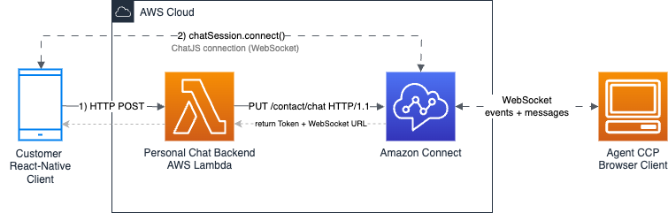

# Amazon Connect Chat - React Native (Expo) ChatJS Demo

A cross-platform demo React Native application for building an Amazon Connect end-customer chat UI. This demo app integrates [ChatJS](https://github.com/amazon-connect/amazon-connect-chatjs), which provides managed websocket connections and simplified Amazon Connect API interactions.

> #### 📌 Security Notice
> This is example code and not intended for production use.
> Dependencies may contain known vulnerabilities.
> Please update all dependencies before using in any production environment.

https://github.com/amazon-connect/amazon-connect-chat-ui-examples/assets/60903378/8887f54a-c121-4246-8981-23d05dd9fa01

## Architecture



## Built With 🛠

- React Native: `v0.71.3`
- Expo: `~51.0.25`
- ChatJS: `amazon-connect-chatjs@^1.5.0`

## Components

ChatScreen includes these main components:

- `initiateChat.js`: handles HTTP request to your personal chat backend
- `ChatSession.js`: low-level abstraction on top of ChatJS
- `ChatWrapper.js`: manages chat state at the UI level, handling loading/disconnect
- `ChatWidget.js`: renders chat composer and transcript

## Getting Started

### Prerequisites

- An Amazon Connect Instance [guide: [Create an Amazon Connect instance](https://docs.aws.amazon.com/connect/latest/adminguide/amazon-connect-instances.html)]
- A Contact Flow ready to receive chat contacts [guide: [Sample inbound flow](https://docs.aws.amazon.com/connect/latest/adminguide/chat.html)]
- A backend proxy endpoint [AWS CloudFormation template: [one-click deploy this Lambda function](https://github.com/amazon-connect/amazon-connect-chat-ui-examples/tree/master/cloudformationTemplates/startChatContactAPI)]
- Node.js `>= 18.x`installed on local machine ([download here](https://nodejs.org/en/download))
- (optional) Android Studio Emulator installed on local machine [docs: [Expo Android Emulator installation](https://docs.expo.dev/workflow/android-studio-emulator/)]
- (optional) iOS Simulator installed on local machine [docs: [Expo iOS Simulator installation](https://docs.expo.dev/workflow/ios-simulator/)]

### Configure your environment

1. Clone the repository

```sh
git clone https://github.com/amazon-connect/amazon-connect-chat-ui-examples.git
cd amazon-connect-chat-ui-examples
cd mobileChatExamples/connectReactNativeChat
```

2. Install dependencies

```sh
npm install --force
```

3. Update credentials

```sh
cp endpoints.sample.js endpoints.js
```

```diff
// endpoints.js

export const GATEWAY = {
+ region: "us-west-2",
+ apiGWId: "ffyyhc0234",
};

const ENDPOINTS = {
+ contactFlowId: "asdf-5056-asdf-a672-asdf6a81ca6",
+ instanceId: "asdf-078b-asdf-9264-asdf98f3c28",
  // ...
};
```

4. (optional) Update permissions to allow WebSocket connections (should work by default in iOS)

Android requires the following line in `AndroidManifest.xml`: (for SDK version >= 23)

```xml
<uses-permission
    android:name="android.permission.ACCESS_NETWORK_STATE"
/>
```

### Running Locally

```sh
# run on http://localhost:PORT
$ yarn run web
```

```sh
# run on local iOS Simulator (XCode)
$ yarn run ios
```

```sh
# run on local Android Emulator (Android Studio)
$ yarn run android
```

```sh
# run on device plugged into laptop
$ npx expo run:ios -d
```

### End-to-end Testing

Once you have the Expo application running on your local machine, you'll test out the end-to-end chat functionality.

1. Ensure it can reach your personal chat proxy backend (e.g. API Gateway + Lambda)

```js
// InitiateChat.js

const startChatResponse = await request("https://${apiId}.execute-api.${region}.amazonaws.com/Prod", {
    method: 'post',
    body: JSON.stringify(initiateChatRequest),
  }).then((res) => res.json.data)

console.log(startChatResponse);
// {
//   startChatResult: {
//     ContactId: 'string',
//     ParticipantId: 'string',
//     ParticipantToken: 'string',
//   }
// }
```

2. After successfully initiating a chat session, login to your Amazon Connect instance and launch the Agent Contact-Control-Panel (CCP)

```
https://<instance-alias>.my.connect.aws/ccp-v2
```

3. Wait for the inbound chat contact, accept it

4. Done! Send messages between the Customer (React Native client) and Agent

## Production Build

For native production builds, please refer to the documentation for [Expo Application Services (EAS)](https://docs.expo.dev/tutorial/eas/introduction/).

## Features

#### Handle App or Page Refresh (Re-Connect to Ongoing Chat)

ChatJS includes WebSocket management, connection heartbeat, and retry mechanisms. If you still run into issues with ChatJS disconnecting, you can store the `chatDetails`

If the application gets disconnected

```js
// 1. Get the `chatDetails` for the ongoing chat
const storedChatDetails = await AsyncStorage.getItem('ongoingChatSessionDetails');
// { ContactId, ParticipantId, ParticipantToken }

// 2. Recreate the ChatJS session with existing ParticipantToken
chatSession = await connect.ChatSession.create({
  chatDetails: storedChatDetails,
  type: "CUSTOMER",
});

await chatSession.connect();
```

#### Attachments

To support file attachments (e.g. images, PDF) in chat, follow these steps:

1. Enable attachments feature for your Amazon Connect Instance [guide: [Enable attachments](https://docs.aws.amazon.com/connect/latest/adminguide/enable-attachments.html)]

2. Upload attachment files with [chatSession.sendAttachment()](https://github.com/amazon-connect/amazon-connect-chatjs?tab=readme-ov-file#chatsessionsendattachment) and

```js
await chatSession.sendAttachment({
  attachment: attachment // type: File [HTML file object, see https://developer.mozilla.org/en-US/docs/Web/API/File]
  metadata: { foo: "bar" }, // optional
});
// supported files: .csv, .doc, .docx, .jpeg, .jpg, .pdf, .png, .ppt, .pptx, .txt, .wav, .xls, .xlsx
// max size: 20MB
// source: https://docs.aws.amazon.com/connect/latest/adminguide/feature-limits.html#feature-limits-chat

// Example usage
var input = document.createElement('input');
input.type = 'file';
input.addEventListener('change', (e) => {
  const file = e.target.files[0];
  chatSession.sendAttachment({ attachment: file })
});
```

3. Handle incoming attachment messages and download with [chatSession.downloadAttachment()](https://github.com/amazon-connect/amazon-connect-chatjs?tab=readme-ov-file#chatsessiondownloadattachment)

```js
chatSession.onMessage(event => {
  const { chatDetails, data } = event;
  const {
    ContentType, // string - 'application/pdf' | 'image/png' | 'text/csv' | 'video/mp4' ...
    Content
    } = data;

  const { AttachmentId, AttachmentName } = Content;
  const attachment = await chatSession.downloadAttachment(AttachmentId);
  // ...
});
```

#### Persistent Chat

With persistent chat, customers can resume previous conversations with the context, metadata, and transcripts carried forward. They don't need to repeat themselves when they return to a chat, and agents have access to the entire conversation history.

Each chat session has an associated `contactId`. This can be used in your personal StartChatContact proxy backend to re-open a closed chat session.

To implement this, please refer to the official documentation ["Admin guide: Enable persistent chat"](https://docs.aws.amazon.com/connect/latest/adminguide/chat-persistence.html)

#### Chat Bot

- AWS Docs: [Add an Amazon Lex bot to Amazon Connect](https://docs.aws.amazon.com/connect/latest/adminguide/amazon-lex.html)
- AWS Docs: [Create conversational AI bots in Amazon Connect](https://docs.aws.amazon.com/connect/latest/adminguide/connect-conversational-ai-bots.html)
- AWS Blog: [Make your Amazon Connect chat experience more engaging with custom participants and generative AI-powered chatbots](https://aws.amazon.com/blogs/contact-center/make-your-amazon-connect-chat-experience-more-engaging-with-custom-participants-and-generative-ai-powered-chatbots/)

## Troubleshooting

#### Enable logging in ChatJS

```diff
// config.js
+ export const ENABLE_CHATJS_LOGS = true;

// ...
```

#### Launch DevTools Debugger

- Physical device: 👋 shake it.
- iOS simulator: Cmd-Ctrl-Z in macOS.
- Android emulator: Cmd-M in macOS or Ctrl-Min Windows.

## License

This project is made available under the MIT-0 license. See the [LICENSE](./LICENSE) file.

Copyright Amazon.com, Inc. or its affiliates. All Rights Reserved.
