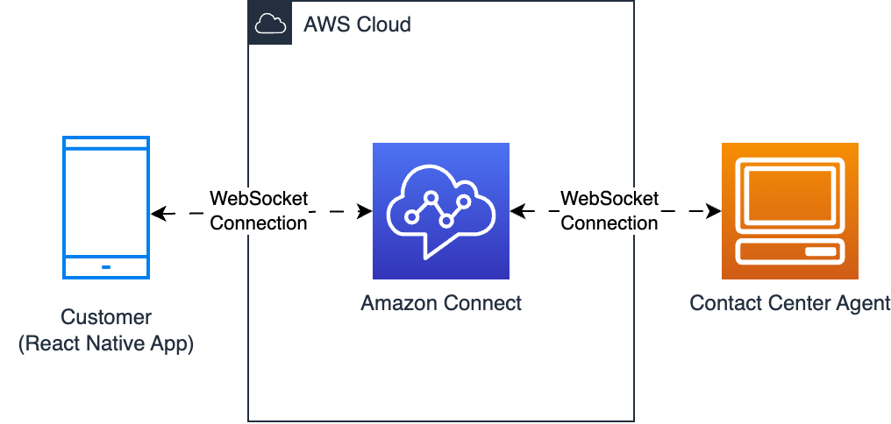

# ChatJS React Native Demo App (Expo)

A React Native starter app for implementing a customer-facing chat UI using Amazon Connect's [ChatJS](https://github.com/amazon-connect/amazon-connect-chatjs) library. Offers out-of-the-box WebSocket management and simplified Amazon Connect API integration.

> ⚠️ This demo code is for example purposes only and should not be used in production without updating dependencies.

<!-- Screen recording -->
https://github.com/amazon-connect/amazon-connect-chat-ui-examples/assets/60903378/8887f54a-c121-4246-8981-23d05dd9fa01



## Quick Links

- [Prerequisites](#prerequisites)
- [Getting Started](#getting-started)
- [End-to-end Testing](#end-to-end-testing)
- [ChatJS Documentation](#chatjs-documentation)
- [Components](#components)
- [Additional Features](#additional-features)
- [Troubleshooting](#troubleshooting)

## Prerequisites

- An [AWS Account](https://aws.amazon.com/console/)
- An Amazon Connect instance (`instanceId`) - [Create an Amazon Connect instance](https://docs.aws.amazon.com/connect/latest/adminguide/amazon-connect-instances.html)
- An Amazon Connect Contact Flow (`contactFlowId`, ["Sample inbound flow"](https://docs.aws.amazon.com/connect/latest/adminguide/sample-inbound-flow.html) recommended)
- **Node.js** installed on your machine `>= v18` ([Download here](https://nodejs.org/en/download))
- _(Optional) Android Studio Emulator installed on local machine [docs: [Expo Android Emulator installation](https://docs.expo.dev/workflow/android-studio-emulator/)]_
- _(Optional) iOS Simulator installed on local machine [docs: [Expo iOS Simulator installation](https://docs.expo.dev/workflow/ios-simulator/)]_

## Getting Started

1. Clone the repository

```sh
git clone https://github.com/amazon-connect/amazon-connect-chat-ui-examples.git
cd amazon-connect-chat-ui-examples
cd mobileChatExamples/connectReactNativeChat
```

2. Install dependencies

```
npm install --force
```

3. Configure the backend

- Find your `instanceId` - docs: https://docs.aws.amazon.com/connect/latest/adminguide/find-instance-arn.html
- Find your `contactFlowId` for "Sample inbound flow" - docs: https://docs.aws.amazon.com/connect/latest/adminguide/sample-inbound-flow.html
- Make sure your frontend points to the correct endpoint:

```js
// src/api/initiateChat.js

const proxyApiEndpoint = 'http://localhost:9000/start-chat';
```

4. Run the local proxy backend

> 📌 Alternatively, you can deploy this Cloudformation template: https://github.com/amazon-connect/amazon-connect-chat-ui-examples/tree/master/cloudformationTemplates/startChatContactAPI

In the **IAM console**, create a role with temporary security credentials for the AWS SDK (or IAM user with CLI **Access key** ).

Then, store the credentials on your local machine `process.env`:

```sh
export AWS_ACCESS_KEY_ID=XXXXX
export AWS_SECRET_ACCESS_KEY=XXXXX
export AWS_SESSION_TOKEN=XXXXX
export AMAZON_CONNECT_INSTANCE_ID=XXXXX
export AMAZON_CONNECT_CONTACT_FLOW_ID=XXXXX
export AMAZON_CONNECT_REGION="us-west-2"
```

```sh
npm run start:backend
# running on http://localhost:9000
```

5. Configure ChatJS WebSocket manager

This step is already provided in the demo app, feel free to skip to the next section.

ChatJS relies on browser's `window.navigator.onLine` for network monitoring, which isn't available in React Native (Hermes JS Engine). Instead, you'll need to configure ChatJS to use React Native's NetInfo API for network status checks.

> 📌 Important: ensure you are using `amazon-connect-chatjs >= v1.5.0`

```js
// ChatWrapper.jsx

import React, { useState, useEffect } from 'react';
import 'amazon-connect-chatjs' // >= v1.5.0 (imports `window.connect`)
import NetInfo from '@react-native-community/netinfo';

const ChatWrapper = () => {
  const [deviceIsOnline, setDeviceIsOnline] = useState(true);

  useEffect(() => {
    // Subscribe to network status updates
    const unsubscribe = NetInfo.addEventListener((state) => {
      setDeviceIsOnline(state.isConnected);
    });

    const getNetworkStatus = () => deviceIsOnline;

    window.connect.ChatSession.setGlobalConfig({
      webSocketManagerConfig: {
        isNetworkOnline: getNetworkStatus, // ADD THIS
      },
    })

    return () => { unsubscribe(); }; // Cleanup to prevent memory leaks
  }, []);
};
```

6. (Optional) Update ChatJS Configuration

```js
// ChatSession.js

class ChatJSClient {
  constructor() {
    // ...

    window.connect.ChatSession.setGlobalConfig({
      // loggerConfig: { useDefaultLogger: false }, // DISABLE logging
      loggerConfig: { useDefaultLogger: true }, // ENABLE logging
      region: 'us-west-2',
    });

    // ...
    this.session = connect.ChatSession.create({
      chatDetails: { contactId, participantId, participantToken },
      disableCSM: true,
      type: 'CUSTOMER',
    })
  }
}
```

7. Run locally

```sh
# run on http://localhost:PORT
$ npm run web
```

```sh
# run on local iOS Simulator (XCode)
$ npm run ios
```

```sh
# run on local Android Emulator (Android Studio)
$ npm run android
```

```sh
# run on device plugged into laptop
$ npx expo run:ios -d
```

## End-to-end testing

1. Launch the demo app on your local machine/device
2. Start a chat session
3. Launch the Agent Chat UI, Contact Control Panel (CCP):  https://<instance-alias>.my.connect.aws/ccp-v2

> Ensure you have access to Agent CCP, ask your Amazon Connect admin to give you the following permission:
> - **Security Profile**: `"CCP: Access CCP"`

## ChatJS Documentation

Please refer to the ChatJS README: https://github.com/amazon-connect/amazon-connect-chatjs


## Components

ChatScreen includes these main components:

- `initiateChat.js`: handles HTTP request to your personal chat backend
- `ChatSession.js`: low-level abstraction on top of ChatJS
- `ChatWrapper.js`: manages chat state at the UI level, handling loading/disconnect
- `ChatWidget.js`: renders chat composer and transcript

## Additional Features

### Interactive Messages

To enhance your chat experience, you can integrate a Lambda function and render picker elements.

Deploy the boilerplate setup here: https://github.com/amazon-connect/amazon-connect-chat-ui-examples/tree/master/samTemplates/amazon-connect-interactive-messages-example-lex-v2

All available templates are outlined in the docs here: https://docs.aws.amazon.com/connect/latest/adminguide/interactive-messages.html#quick-reply-template

### Attachments

To support file attachments (e.g. images, PDF) in chat, follow these steps:

1. Enable attachments feature for your Amazon Connect Instance [guide: [Enable attachments](https://docs.aws.amazon.com/connect/latest/adminguide/enable-attachments.html)]

2. Upload attachment files with [chatSession.sendAttachment()](https://github.com/amazon-connect/amazon-connect-chatjs?tab=readme-ov-file#chatsessionsendattachment) and

```js
await chatSession.sendAttachment({
  attachment: attachment // type: File [HTML file object, see https://developer.mozilla.org/en-US/docs/Web/API/File]
  metadata: { foo: "bar" }, // optional
});
// supported files: .csv, .doc, .docx, .jpeg, .jpg, .pdf, .png, .ppt, .pptx, .txt, .wav, .xls, .xlsx
// max size: 20MB
// source: https://docs.aws.amazon.com/connect/latest/adminguide/feature-limits.html#feature-limits-chat

// Example usage
var input = document.createElement('input');
input.type = 'file';
input.addEventListener('change', (e) => {
  const file = e.target.files[0];
  chatSession.sendAttachment({ attachment: file })
});
```

3. Handle incoming attachment messages and download with [chatSession.downloadAttachment()](https://github.com/amazon-connect/amazon-connect-chatjs?tab=readme-ov-file#chatsessiondownloadattachment)

```js
chatSession.onMessage(event => {
  const { chatDetails, data } = event;
  const {
    ContentType, // string - 'application/pdf' | 'image/png' | 'text/csv' | 'video/mp4' ...
    Content
    } = data;

  const { AttachmentId, AttachmentName } = Content;
  const attachment = await chatSession.downloadAttachment(AttachmentId);
  // ...
});
```

#### Persistent Chat

Persistent Chat allows you to start a new chat sesion and rehydrate the entire previous chat conversation with the context, metadata, and transcripts carried forward. They don't need to repeat themselves when they return to a chat, and agents have access to the entire conversation history.

Each chat session has an associated `ContactId`. This can be used in passed with the StartChatContact API request.

To implement this, please refer to the official documentation ["Admin guide: Enable persistent chat"](https://docs.aws.amazon.com/connect/latest/adminguide/chat-persistence.html)

```js
PUT /contact/chat HTTP/1.1
Content-type: application/json
{
   "Attributes": {
      "string" : "string"
   },
   "ContactFlowId": "string",
   "InitialMessage": {
      "Content": "string",
      "ContentType": "string"
   },
   "InstanceId": "string",
   ... // other chat fields

   // NEW Attribute for persistent chat
   "PersistentChat" : {
       "SourceContactId":"2222222-aaaa-bbbb-2222-222222222222222"
       "RehydrationType":"FROM_SEGMENT"
   }
}
```

#### Chat Bot

- AWS Docs: [Add an Amazon Lex bot to Amazon Connect](https://docs.aws.amazon.com/connect/latest/adminguide/amazon-lex.html)
- AWS Docs: [Create conversational AI bots in Amazon Connect](https://docs.aws.amazon.com/connect/latest/adminguide/connect-conversational-ai-bots.html)
- AWS Blog: [Make your Amazon Connect chat experience more engaging with custom participants and generative AI-powered chatbots](https://aws.amazon.com/blogs/contact-center/make-your-amazon-connect-chat-experience-more-engaging-with-custom-participants-and-generative-ai-powered-chatbots/)

## Troubleshooting

### Enable ChatJS logging

```js
// ChatSession.js

class ChatJSClient {
  constructor() {
    // ...

    window.connect.ChatSession.setGlobalConfig({
      // loggerConfig: { useDefaultLogger: false }, // DISABLE
      loggerConfig: { useDefaultLogger: true }, // ENABLE
    });
  }
}
```

### Launch Expo DevTools Debugger

- Physical device: 👋 shake it.
- iOS simulator: Cmd-Ctrl-Z in macOS.
- Android emulator: Cmd-M in macOS or Ctrl-Min Windows.

### WebSocket Not Working on Android Device

Ensure you have enable permissions to allow WebSocket connections.

For SDK version >= 23, Android requires the following line in `AndroidManifest.xml`:

```xml
<uses-permission
    android:name="android.permission.ACCESS_NETWORK_STATE"
/>
```

### Connection Management

```js
chatSession.onConnectionLost(async () => {
  console.log('Websocket lost connection');
  // Implement reconnection logic
  await chatSession.connect();
});

chatSession.onConnectionEstablished(() => {
  console.log('WebSocket connection has been established/reestablished');
});

chatSession.onConnectionBroken(event => {
  console.log('WebSocket connection is broken or terminated');
});
```

### Network Health Checks

```js
chatSession.onDeepHeartbeatSuccess(() => {
  console.log('WebSocket connection healthy');
});

chatSession.onDeepHeartbeatFailure(() => {
  console.log('WebSocket connection issues detected');
});
```


### Handling Out-of-Order WebSocket Messages

ChatJS delivers messages in the order they are received, which may not match their actual timestamp order. You'll need to manually sort messages using their timestamps and filter duplicates by ID.

```js
const response = await chatSession.getTranscript({
    scanDirection: "BACKWARD",
    sortOrder: "ASCENDING",
    maxResults: 15
});

const { Transcript } = response.data;
Transcript.forEach(message => {
    const timestamp = new Date(message.AbsoluteTime).toLocaleTimeString();
    const id = message.Id;
    // Sort messages by timestamp and filter duplicates using message ID
});
```

### Messages Not Received During Network Disconnection

If a chat participant loses network connection during a session, the client may fail to receive WebSocket messages.

ChatJS requires manually calling `chatSession.getTranscript()` to fetch missed messages after reconnecting.

```js
// Fetch any missed messages by retrieving the recent transcript
chatSession.onConnectionEstablished(() => {
    console.log('WebSocket connection has been established/reestablished');

    // Get recent messages including any that were missed while offline
    const response = await chatSession.getTranscript({
        scanDirection: "BACKWARD",
        sortOrder: "ASCENDING",
        maxResults: 15
    });

    const { Transcript } = response.data;
    // ... filter and render the updated transcript
});
```

### CSM not initialized

Client-side-metric (CSM) is an internal feature. This functionality is enabled by default but completely safe to disable.

```log
ChatJS-csmService: Failed to addCountAndErrorMetric csm:  ReferenceError: Property 'csm' doesn't exist undefined

ChatJS-csmService: Failed to addLatencyMetric csm:  ReferenceError: Property 'csm' doesn't exist undefined

addCSMCountMetric: CSM not initialized TypeError: Cannot read properties of null (reading 'Metric')
```

**Fix:**

```js
connect.ChatSession.create({
  // ...
  disableCSM: true
})
```

## License

This project is made available under the MIT-0 license. See the [LICENSE](./LICENSE) file.

Copyright Amazon.com, Inc. or its affiliates. All Rights Reserved.


