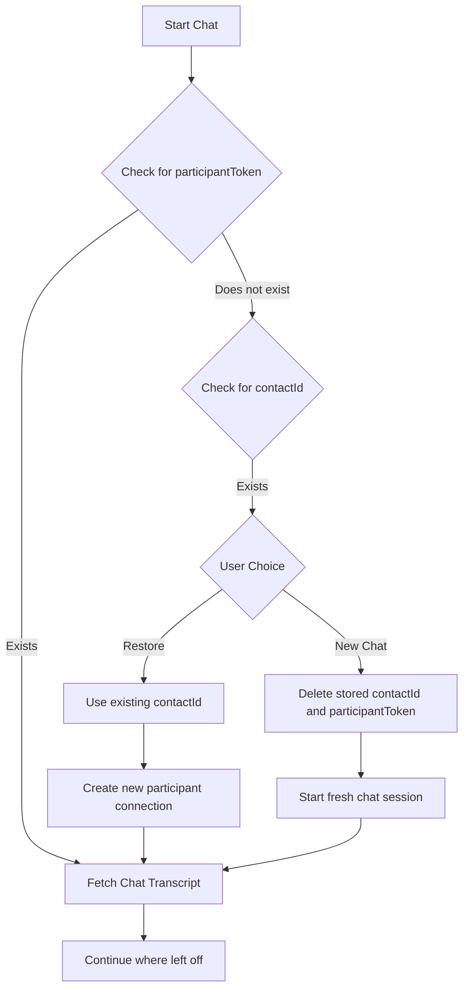

# iOS Native Chat Demo 📱
 
An iOS example app for building custom Amazon Connect Chat. This solution implements basic [ChatWidget](https://docs.aws.amazon.com/connect/latest/adminguide/add-chat-to-website.html) functionality and is capable of Interactive Messages.

> Refer to [#Specifications](#speficications) for details on compatibility, supported versions, and platforms.

**Reference:**

- Documentation: https://docs.aws.amazon.com/connect/latest/adminguide/enable-chat-in-app.html

https://github.com/amazon-connect/amazon-connect-chat-ui-examples/assets/143978428/86fee2ac-e32f-4184-bbd2-f54add78f8dc

## Contents

- [Prerequisites](#prerequisites)
- [Local Development](#local-development)
- [How is it working?](#how-is-it-working)


## Prerequisites

- Create an Amazon Connect Instance [[guide](https://docs.aws.amazon.com/connect/latest/adminguide/amazon-connect-instances.html)]
  - OR: enable chat experience for an existing Connect instance. [[guide](../../README.md#enabling-chat-in-an-existing-amazon-connect-contact-center)]

- Create an Amazon Connect Contact Flow, ready to receive chat contacts. [[guide](https://docs.aws.amazon.com/connect/latest/adminguide/chat.html)]

    - Note the `instanceId` [[guide](https://docs.aws.amazon.com/connect/latest/adminguide/find-instance-arn.html)]
    - Find the `contactFlowId` for the ["Sample Inbound Flow (First Contact)"](https://docs.aws.amazon.com/connect/latest/adminguide/sample-inbound-flow.html) [[guide](https://docs.aws.amazon.com/connect/latest/adminguide/find-contact-flow-id.html)]

- Deploy a custom Amazon Connect Chat backend. [Refer to this backend template](../../cloudformationTemplates/startChatContactAPI/README.md)

    - Deploy a StartChatContact template Lambda [[CloudFormation Template](https://github.com/amazon-connect/amazon-connect-chat-ui-examples/tree/master/cloudformationTemplates/startChatContactAPI)]
    - Add the `region`, `startChatEndPoint`, `contactFlowId`, and `instanceId` to `Config.swift`.

- (Optional) Setup interactive messages [guide](https://aws.amazon.com/blogs/contact-center/easily-set-up-interactive-messages-for-your-amazon-connect-chatbot/)
  - If using above, make sure to deploy startChatContact template again with interactive message `contactFlowId` and update down the endpoints.

## Local Development

> Versions: Xcode 15, Swift 5
<br> Download Xcode: https://developer.apple.com/xcode/

1. Clone this repository: https://github.com/amazon-connect/amazon-connect-chat-ui-examples/tree/master/
    ```sh
    $ git clone https://github.com/amazon-connect/amazon-connect-chat-ui-examples.git
    ```
2. Navigate to the project directory `iOSChatExample` and make sure that `Podfile` is there, then run `pod install`.
3. Once that is done, You will be able to see a workspace generated `iOSChatExample.xcworkspace`, double click and that will launch the project in Xcode.

4. Edit the [Config file](https://github.com/amazon-connect/amazon-connect-chat-ui-examples/tree/master/mobileChatExamples/iOSChatExample/iOSChatExample/Common/Config.swift) with your instance details as generated in [Prerequisites](#prerequisites)

    > Make sure you have iOS Simulator added [Adding additional simulators](https://developer.apple.com/documentation/safari-developer-tools/adding-additional-simulators)

5. Once everything looks okay, Run the app by clicking on ▶️ button on top left or hit `Cmd + R`.

## How is it working?

### ChatManager
It is responsible for managing the chat state, including initiating the chat, sending and receiving messages, and closing the chat connection when done.

- **Managing Messages**: It holds an array of Message objects, which are published to the UI to reflect real-time chat updates.
- **Handling WebSockets**: ChatManager integrates with WebsocketManager to manage WebSocket connections for real-time message delivery.
- **Interfacing with AWS Services**: Utilizes the AWS Connect Participant Service to register a participant and establish a chat session.

#### Initialization:
Upon instantiation, ChatManager sets up necessary configurations and prepares the AWS Connect Participant client.
- **Chat Initiation**:
When initiateChat is called, it ensures that a WebSocket URL is available, then creates a WebSocket manager instance that listens for incoming messages and events.
- **Message Handling**:
handleIncomingMessage processes incoming messages and updates the UI accordingly. It filters out typing indicators and handles message status updates (e.g., delivered, read).
- **Chat API Calls**:
The manager makes API calls to start chat sessions (startChatContact), create participant connections (createParticipantConnection), and send messages or events (sendChatMessage, sendEvent).

### WebsocketManager:
The WebsocketManager handles the WebSocket connection lifecycle and receives chat messages and other events.

- **WebSocket Connection**:
Manages the WebSocket connection, handling connect and disconnect events, and transmitting chat messages.
- **Receiving Messages**:
Implements the didReceive delegate method to handle different WebSocket events, such as incoming text messages that are then passed to the messageCallback.

- **Connection**:
Connects to the WebSocket using the provided URL and listens for events.
- **Event Handling**:
On receiving events, it delegates processing to the appropriate handlers, for instance:
Messages are processed and passed to ChatManager through the messageCallback.
Connection status changes are logged, and isConnected status is updated.
- **Message Distribution**:
Incoming text messages are deserialized and depending on their type (MESSAGE, EVENT, etc.), appropriate actions are taken, such as updating UI or acknowledging message receipt.

- **websocketDidConnect**: Called when the WebSocket connects, and may subscribe to topics if necessary.
- **websocketDidReceiveMessage**: Parses and handles incoming messages, delegating them back to ChatManager for UI updates.


### Chat Rehydration

Chat rehydration is a feature that allows users to continue their previous chat sessions. This process involves several checks and actions:

- **Check for Participant Token:**
  On initiating chat, the module first checks if a `participantToken` exists.
  - If it exists, the module proceeds to fetch the chat transcript, allowing the user to continue from where they left off.
  - If it does not exist, the module then checks for a `contactId`.

- **Use of Contact ID:**
  If a `contactId` exists, the module prompts the user to either restore the previous session or start a new chat.
  - If the user chooses to restore, the module starts a new chat session with the existing `contactId`, creates a new participant connection, and then fetches the transcript.
  - If the user opts for a new chat, the module deletes the stored `contactId` and `participantToken` from the storage, ensuring a fresh start. The chat begins with no prior context, emulating the start of a new conversation.

- **Deleting Stored Values:**
  For users who opt to start a new chat, the module ensures that previous session identifiers are cleared. This action prevents any overlap or confusion between different chat sessions. By removing the `participantToken` and `contactId`, the ChatManager guarantees that the new chat session does not carry over any data or context from previous sessions.



Sample demo: 

https://github.com/amazon-connect/amazon-connect-chat-ui-examples/assets/143978428/4b207751-289f-4de1-b9b9-4e947ce48812


## Specifications

### Technical Specifications

- Language: Swift 5.x
- Xcode : 15
- iOS: iOS 16 and Higher (⚠️ Required)
- Frameworks:
  - SwiftUI: For UI components and layout.
  - AsyncImage: For loading images asynchronously.
- Networking: Utilizing URLSession for network calls to fetch images and send/receive messages.
- Markdown Parsing: AttributedString for rendering markdown text.

### Code Quality

- MV Architecture: Separation of concerns between the view, model.
- Reusable Components: Modular design with reusable views and components.
- Error Handling: Comprehensive error handling for networking and data persistence.
- Memory Management: Use of @ObservedObject and @State to manage the lifecycle of data objects.
