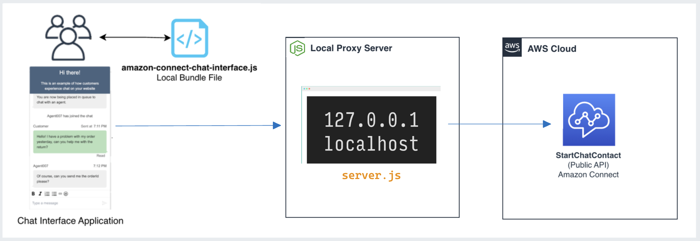
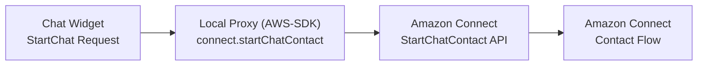
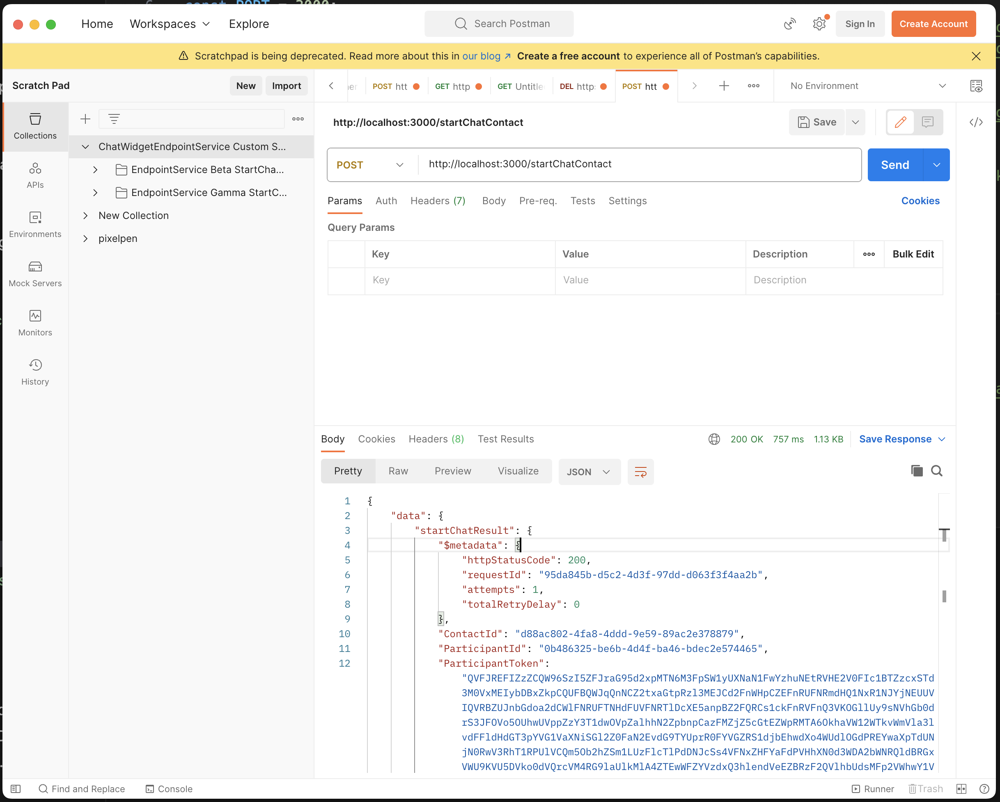
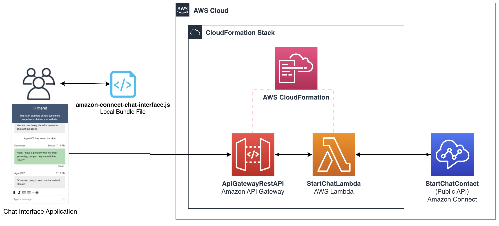

## StartChatContact Local Proxy Server

Solution to run local proxy server for the Amazon Connect StartChatContact Public API. Can be used during local development when building a custom chat interface, in any of the following examples:

- https://github.com/amazon-connect/amazon-connect-chat-interface
- https://github.com/amazon-connect/amazon-connect-chat-ui-examples/tree/master/customChatWidget
- https://github.com/amazon-connect/amazon-connect-chat-ui-examples/tree/master/connectReactNativeChat






### Prerequisites

- Create an Amazon Connect Instance [[guide](https://docs.aws.amazon.com/connect/latest/adminguide/amazon-connect-instances.html)]

  - OR: enable chat experience for an existing Connect instance. [[guide](../README.md#enabling-chat-in-an-existing-amazon-connect-contact-center)]

- Create an Amazon Connect Contact Flow, ready to receive chat contacts. [[guide](https://docs.aws.amazon.com/connect/latest/adminguide/chat.html)]

  - Note the `instanceId` [[guide](https://docs.aws.amazon.com/connect/latest/adminguide/find-instance-arn.html)]
  - Find the `contactFlowId` for the ["Sample Inbound Flow (First Contact)"](https://docs.aws.amazon.com/connect/latest/adminguide/sample-inbound-flow.html) [[guide](https://docs.aws.amazon.com/connect/latest/adminguide/find-contact-flow-id.html)]

### Usage

```sh
$ git clone https://github.com/amazon-connect/amazon-connect-chat-ui-examples
$ cd amazon-connect-chat-ui-examples/startChatContactAPILocalProxy
$ npm install
```

```js
// server.js

const REGION = 'us-west-2' // AWS region of the instance
const CREDENTIALS = {
  // Documentation: https://docs.aws.amazon.com/sdk-for-javascript/v3/developer-guide/setting-credentials-node.html
  accessKeyId: '<STRING>',
  secretAccessKey: '<STRING>',
  sessionToken: '<STRING>',
}
```

```
$ npm run start
# server running on http:localhost:3000
```

```js
connect.ChatInterface.initiateChat({
  region: 'us-west-2', // AWS region of the instance
  apiGatewayEndpoint: 'http://localhost:3000/startChatContact', // <-- IMPORTANT
  contactFlowId, // GUIDE: https://docs.aws.amazon.com/connect/latest/adminguide/find-contact-flow-id.html
  instanceId, // GUIDE: https://docs.aws.amazon.com/connect/latest/adminguide/find-instance-arn.html
  name: 'Satoshi',
  contactAttributes: JSON.stringify({
    customerName: 'Satoshi',
  }),
  supportedMessagingContentTypes: 'text/plain,text/markdown', // include 'text/markdown' for rich messaging support
  headers: {
    'Accept': 'application/json',
    'Content-Type': 'application/json'
  }
}, successHandler, failureHandler);
```

### Testing

To test this, you can make a POST request using [Postman](https://www.postman.com) to the server running on `localhost`

```sh
curl --location 'http://localhost:3000/startChatContact' \
--header 'Content-Type: application/json' \
--data '{
    "ContactFlowId": "<STRING>",
    "InstanceId": "<STRING>",
}'
```



### Example Request/Reponse

```
// Example POST Request

{
    "ContactFlowId": "asdf-adsf-asdf-asdf-asdf",
    "InstanceId": "asdf-adsf-asdf-asdf-asdf",
    "ParticipantDetails": {
        "DisplayName": "Customer2"
    },
    "Attributes": {
        "customerName": "Customer2"
    },
    "SupportedMessagingContentTypes": [
        "text/plain",
        "text/markdown"
    ]
}

```

```
// Example 200 Response

{
  "data": {
      "startChatResult": {
          "$metadata": {
              "httpStatusCode": 200,
              "requestId": "95da845b-d5c2-4d3f-97dd-d063f3f4aa2b",
              "attempts": 1,
              "totalRetryDelay": 0
          },
          "ContactId": "d88ac802-4fa8-4ddd-9e59-89ac2e378879",
          "ParticipantId": "0b486325-be6b-4d4f-ba46-bdec2e574465",
          "ParticipantToken": "QVFJREFIZzZCQW96SzI5ZFJraG95d2xpMTN6M3FpSW1yUXNaN1FwYzhuNEtRVHE2V0FIc1BTZzcxSTd3M0VxMEIybDBxZkpCQUFBQWJqQnNCZ2txaGtpRzl3MEJCd2FnWHpCZEFnRUFNRmdHQ1NxR1NJYjNEUUVIQVRBZUJnbGdoa2dCWlFNRUFTNHdFUVFNRTlDcXE5anpBZ2FQRCs1ckFnRVFnQ3VKOGllUy9sNVhGb0drS3JFOVo5OUhwUVppZzY3T1dwOVpZalhhN2ZpbnpCazFMZjZ5cGtEZWpRMTA6OkhaVW12WTkvWmVla3lvdFFldHdGT3pYVG1VaXNiSGl2Z0FaN2EvdG9TYUprR0FYVGZRS1djbEhwdXo4WUdlOGdPREYwaXpTdUNjN0RwV3RhT1RPUlVCQm5Ob2hZSm1LUzFlcTlPdDNJcSs4VFNxZHFYaFdPVHhXN0d3WDA2bWNRQldBRGxVWU9KVU5DVko0dVQrcVM4RG9laUlkMlA4ZTEwWFZYVzdxQ3hlendVeEZBRzF2QVlhbUdsMFp2VWhwY1VueEpvQmFzNUN1ZjhLdVVEaGRja1U5UDB2aUV2RTVhMktFczhRPT0="
      }
  }
}
```

## Production StartChatContact Backend

Beyond local development, you can deploy a production infrastructure, via the API Gateway StartChatContact CloudFormation template: https://github.com/amazon-connect/amazon-connect-chat-ui-examples/tree/master/cloudformationTemplates/startChatContactAPI



## Specifications

- Node v18 LTS
- `express@^4.0.0`
- `@aws-sdk/client-connect@^3.370.0`

## Troubleshooting and Support

Review the resources given in the README for guidance on how to develop on this library. Additionally, search our [issues database](https://github.com/amazon-connect/amazon-connect-chat-ui-examples/issues) to see if your issue is already addressed. If not please cut us an [issue](https://github.com/amazon-connect/amazon-connect-chat-ui-examples/issues/new/choose) using the provided templates.

If you have more questions, or require support for your business, you can reach out to [AWS Customer support](https://aws.amazon.com/contact-us). You can review our support plans [here](https://aws.amazon.com/premiumsupport/plans/?nc=sn&loc=1).

## License

This project is made available under the MIT-0 license. See the LICENSE file.

Copyright Amazon.com, Inc. or its affiliates. All Rights Reserved.
