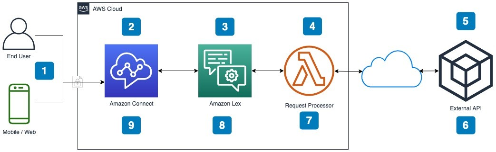
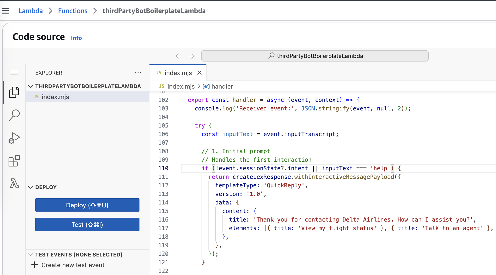
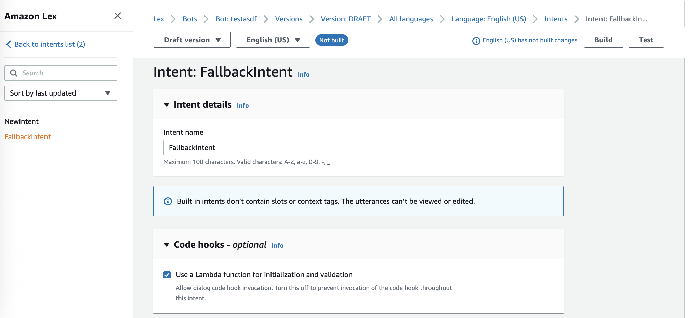
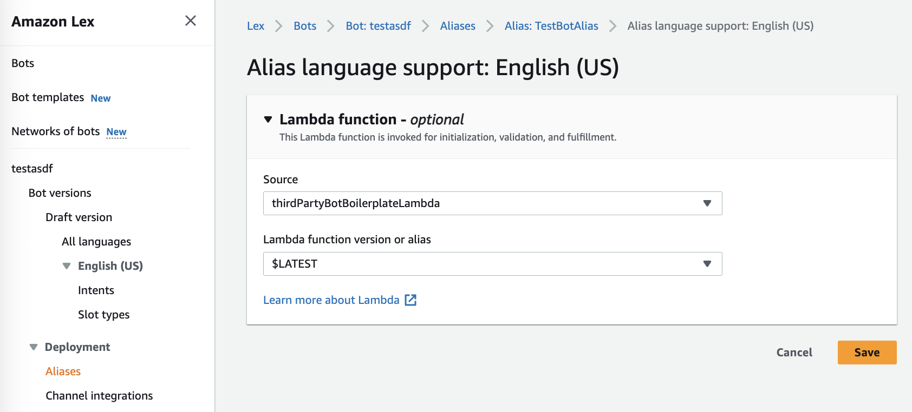
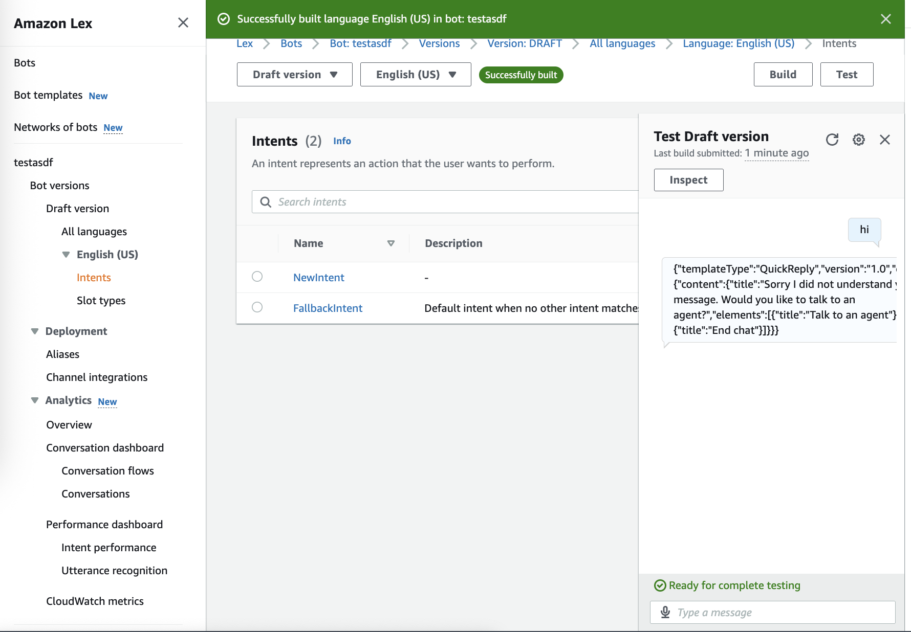
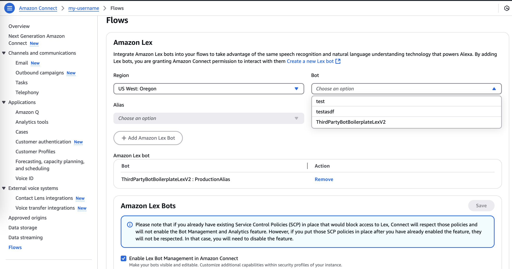
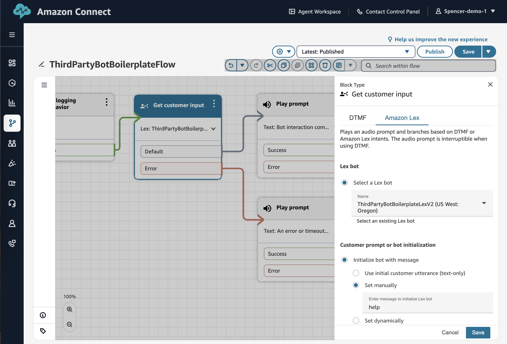
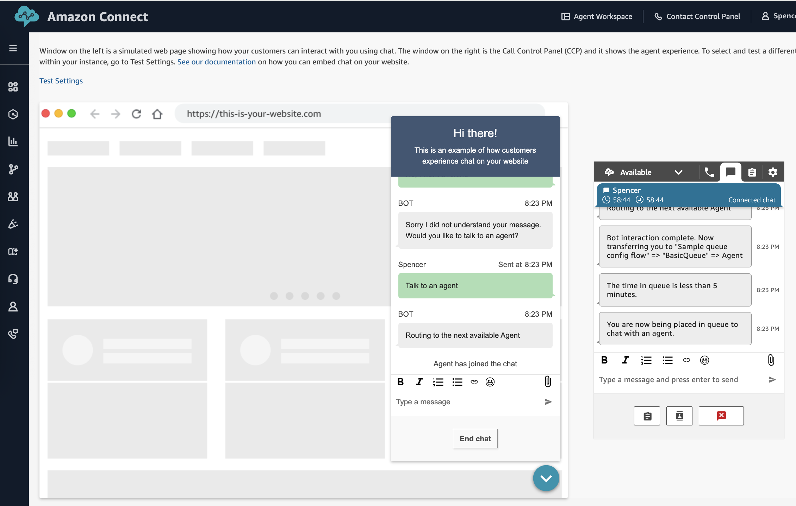
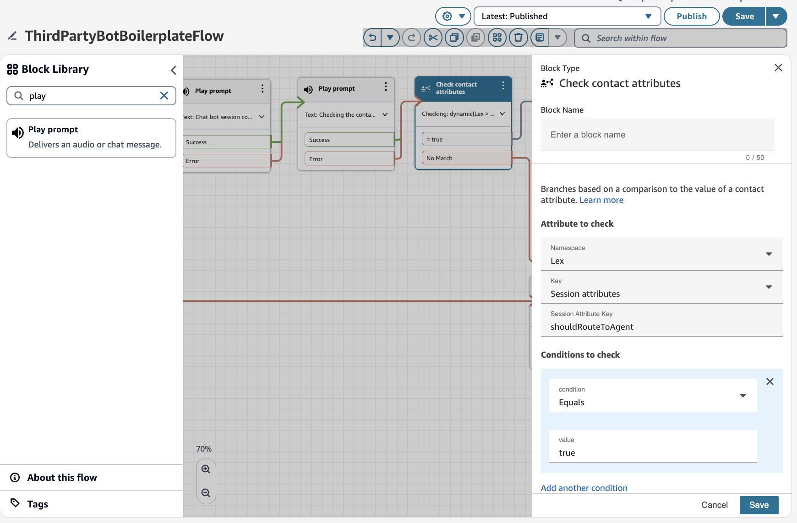

# Amazon Connect Chatbot with Third-party Integration

This repository provides boilerplate code and instructions for building a chatbot with third-party integration for Amazon Connect Voice and Messaging contacts. The solution integrates Amazon Lex V2, AWS Lambda for backend logic, and connects to external APIs, bots, or generative AI services. The architecture enables flexible conversational experiences without requiring predefined utterances.

**End-customer experience:**

https://github.com/user-attachments/assets/100f03b6-e6f6-479f-af59-8e2ab1ecbb4e

## Architecture



1. User calls Amazon Connect using the telephone number for the connect instance.
2. Amazon Connect receives the incoming call and starts an Amazon Connect contact flow. This Amazon Connect flow captures the caller’s utterance and forwards it to Amazon Lex.
3. Amazon Lex starts the requested bot. The Amazon Lex bot translates the caller’s utterance into text and sends it to AWS Lambda via an event.
4. AWS Lambda accepts the incoming data, transforms or enhances it as needed, and calls out to the external API via some transport
5. The external API processes the content sent to it from AWS Lambda.
6. The external API returns a response back to AWS Lambda.
7. AWS Lambda accepts the response from the external API, then forwards this response to Amazon Lex.
8. Amazon Lex returns the response content to Amazon Connect.
9. Amazon Connect processes the response.


## Prerequisites

- [An AWS account](https://signin.aws.amazon.com/signup?request_type=register)
- [Amazon Connect Instance](https://docs.aws.amazon.com/connect/latest/adminguide/amazon-connect-instances.html)
- Admin permissions for Amazon Connect, Amazon Lex, and AWS Lambda (optional: CloudWatch)

## Installation

### Create Lambda Function

- Open the [AWS Management Console](https://console.aws.amazon.com)
- Navigate to **AWS Lambda** console in your desired AWS region (e.g., us-west-2)
- Click **Create function**
- Select **Author from scratch**
- Enter a **Function name** (e.g., "ThirdPartyLexConnectIntegration")
- Select your desired **Runtime**, this example uses **Node.js 22.x**
- Keep all other default settings
- Click **Create function**
- In the **Code** tab, locate the `index.mjs` file in the code editor
- Replace the existing code with the contents of [lambda.js](./lambda.js)

```diff
// index.mjs

+  export const handler = async (event, context) => {
+    console.log('Received event:', JSON.stringify(event, null, 2));
+    // ...
+
+  }
```

- In **Runtime settings**, ensure the **Handler** is set to `index.handler`
- Click **Deploy**



### Test the Lambda Function

- Open your **Lambda function** in the console
- Open **Test** tab
- Create a test event
- Paste this JSON example event, and run it

```json
// Example incoming Lamba event (triggered by Lex V2):

{
  "sessionId": "asdf-asdf-asdf-ae78-0feb82411207",
  "requestAttributes": {
    "x-amz-lex:accept-content-types": "PlainText",
    "x-amz-lex:channels:platform": "Connect Chat"
  },
  "inputTranscript": "help",
  "interpretations": [
    {
      "intent": {
        "name": "FallbackIntent",
        "state": "InProgress",
        "slots": {},
        "confirmationState": "None"
      },
      "interpretationSource": "Lex"
    },
    {
      "intent": {
        "name": "ThirdPartyBotIntentUnused",
        "state": "InProgress",
        "slots": {},
        "confirmationState": "None"
      },
      "interpretationSource": "Lex",
      "nluConfidence": 0.5
    }
  ],
  "bot": {
    "name": "ThirdPartyBotBoilerplateLexV2",
    "version": "1",
    "localeId": "en_US",
    "id": "92748AAADDD",
    "aliasId": "JAHDHD092934",
    "aliasName": "ProductionAlias"
  },
  "responseContentType": "text/plain; charset=utf-8",
  "messageVersion": "1.0",
  "invocationSource": "DialogCodeHook",
  "sessionState": {
    "sessionAttributes": {
      "x-amz-lex:connect-originating-request-id": "asdf-356c-asdf-asdf-1f45c0eaf3b1"
    },
    "intent": {
      "name": "FallbackIntent",
      "state": "InProgress",
      "slots": {},
      "confirmationState": "None"
    },
    "originatingRequestId": "asdf-356c-asdf-asdf-1f45c0eaf3b1"
  },
  "transcriptions": [
    {
      "resolvedContext": {
        "intent": "FallbackIntent"
      },
      "transcription": "help",
      "resolvedSlots": {},
      "transcriptionConfidence": 1
    }
  ],
  "inputMode": "Text"
}
```

- Your function should execute and return a JSON object:

```js
// Example response (returned to Lex V2)

{
  sessionState: {
    dialogAction: {
      type: 'Close',
    },
    intent: {
      name: 'FallbackIntent',
      state: 'Fulfilled',
    },
    sessionAttributes: {
      keyName: 'foobar', // Pass attributes back to the contact flow. Accessible with `$.Lex.SessionAttributes.['keyName']`
    },
  },
  messages: [
    {
      contentType: 'PlainText',
      content: '<some Lex bot response>',
    },
  ],
}
```

### Create Lex V2 Bot

- Open the [AWS Management Console](https://console.aws.amazon.com)
- Navigate to **Amazon Lex** console in your desired AWS region (e.g., us-west-2)
- Click **Create bot**
- Select **Traditional** for Creation method
- Keep all other default settings
- Click **Next**, **Done**
- The new bot should include a **NewIntent** (Bot: BOT_NAME > Versions > Version: Draft > All languages > Language: English (US) > Intents)
- Change the **NewIntent** name to `PlaceholderIntentUnused` and click "Save Intent"
- In **NewIntent** under **Sample utterances**, add string "placeholder-utterance-not-used", click "Add utterance" and click "Save Intent" (this is just to satisfy Lex build requirement)
- Open the settings for **FallbackIntent** (Bot: BOT_NAME > Versions > Version: Draft > All languages > Language: English (US) > Intents)
- For **FallbackIntent**, scroll down to "Use a Lambda function for initialization and validation" and check the input box, click "Save Intent"
- Also for **FallbackIntent**, scroll down to **Fullfilment** and set to active, click "Save Intent"
- Click **Build** and wait for that to complete



### Configure Lex V2 Bot

- Open the **Amazon Lex** console in your desired AWS region (e.g., us-west-2)
- Navigate to **Alias Lambda function** settings - Bot: BOT_NAME > Aliases > Alias: ProductionAlias > Alias language support: English (US)
- In the dropdown, select  your newly created **AWS Lambda** code hook
- Click **Save**



### Test Lex V2 Bot

- Open the **Amazon Lex** console in your desired AWS region (e.g., us-west-2)
- Navigate to the **Intents** view
- If you don't see "Successfully built" alert, click **Build**
- Click **Test** to launch the chat window
- Enter "help" to trigger the Lex/Lambda
- Verify the response from the lambda: `{"templateType":"QuickReply","version":"1.0","data":{"content":{"title":"Thank...}`

> Note: Lambda code hook errors can be found in CloudWatch logs at `/aws/lambda/<my-lambda-name>`



### Associate Lex Bot with Connect

- Open the [AWS Management Console](https://console.aws.amazon.com)
- Navigate to **Amazon Connect** console in your desired AWS region (e.g., us-west-2)
- Click **Flows** tab on the left sidebar
- Find **Amazon Lex** settings, and choose your new Lex Bot in the **Bot dropdown**
- Select `TestAlias` from the **Alias dropdown**



### Create Contact Flow

- Log in to the instance: `https://<instance-alias>.my.connect.aws`
- Navigate to flows page: `https://<instance-alias>.my.connect.aws/contact-flows`
- Click **Create flow**
- Click the dropdown arrow next to the ”Save” button, select “Import (beta)”
- Upload the [`ThirdPartyChatBotContactFlow.json`](./ThirdPartyChatBotLexV2-JSON.zip) file
- Find the **Get customer input block**
- For **Lex bot** settings, select your block from the dropdown
- (optional but recommended) Update settings to auto-trigger the Lex bot without customer prompt - Find settings for **Customer prompt or bot initialization**, select "Initialize bot with message" > "Set manually" > enter `help` (this is hard-coded in the Lambda function)
- Click **Save**
- Click **Publish** finish configuring the Contact Flow



### Test the End-to-End Experience

- Get access to the default Amazon Connect Instance Admin user, or have a user profile assigned to `Basic Routing Profile` (routes to `BasicQueue`)
- Log in to the instance: `https://<instance-alias>.my.connect.aws`
- Navigate to Test chat page: `https://<instance-alias>.my.connect.aws/test-chat`
- Update settings to use the new Contact Flow, click **Test Settings** and select your flow from the dropdown, click **Save**
- Launch the End-customer Chat Widget
- Enter prompts in the chat, send messages to the lex bot
- (optional) Enter `Talk to an agent` in chat
- (optional) Enable or launch CCP UI (for Agent Chat) `https://<instance-alias>.my.connect.aws/ccp-v2`
- (optional) Accept the incoming chat contact

> Note: Contact Flow errors can be found in CloudWatch logs at `/aws/connect/<instance-alias>`




### (Optional) Passing Contact Attributes to Lex

TODO

Pass customerId?
Pass contactId?

### (Optional) Returning Lex Session Attributes to Contact Flow

When the Lex chatbot conversation is complete, you may want to pass data to the Amazon Connect Contact Flow for dynamic routing logic. To achieve this, you can set the `sessionAttributes` with key/value pairs in the **Lambda function**. Lex will forward this to the contact flow.

```js
// Sample Lambda response, returned to Lex

{
  sessionState: {
    dialogAction: {
      type: 'Close',
    },
    intent: {
      name: 'FallbackIntent',
      state: 'Fulfilled',
    },
    // Pass contact attributes to the contact flow. Accessible with `$.Lex.SessionAttributes.['keyName']`
    sessionAttributes: {
      keyName: 'foobar'
    },
  },
  messages: [
    {
      contentType: 'PlainText',
      content: '<some Lex bot response>',
    },
  ],
}
```

For example, the sample Lambda returns `shouldRouteToAgent` to conditionally end chat OR continue to a contact center Agent.

```
$.Lex.SessionAttributes.['shouldRouteToAgent']
```



## Usage

Your Contact Center is ready to receive inbound Chat and Voice contacts.

You can:

- Add a [pre-built Hosted Omni-channel Widget](https://docs.aws.amazon.com/connect/latest/adminguide/add-chat-to-website.html) (e.g. Chat, Voice) to your website
- Build a custom Chat UI using [ChatJS](https://github.com/amazon-connect/amazon-connect-chatjs) - Example Chat UI: https://github.com/amazon-connect/amazon-connect-chat-interface
- Integrate with SMS inbound contacts [[docs](https://docs.aws.amazon.com/connect/latest/adminguide/setup-sms-messaging.html)]
- Integrate with Apple Messages for Business [[docs](https://docs.aws.amazon.com/connect/latest/adminguide/apple-messages-for-business.html)]
- And more...

## Troubleshooting

### Lex Bot Issues

1. To enable Lex bot logs:

- Open CloudWatch
- Naviate to Log Groups
- Create a CloudWatch log group (or re-use the Lambda one: `/aws/lambda/<my-lambda-name>`)
- Open **Amazon Lex V2** console
- From the list, choose a bot.
- From the left menu, choose **Aliases**.
- In the list of aliases, choose the alias for which you want to configure conversation logs.
- In the Conversation logs section, choose Manage conversation logs.
- For text logs, choose Enable then enter the Amazon CloudWatch Logs log group name.
- For audio logs, choose Enable then enter the S3 bucket information.
- Choose Save to start logging conversations. If necessary, Amazon Lex V2 will update your service role with permissions to access the CloudWatch Logs log group and selected S3 bucket.

2. To view Lex bot function errors and logs:

- Open CloudWatch
- Naviate to Log Groups
- Find `/aws/path/to/<my-group-name>`

3. To test the Lex Bot interaction:

- Open the **Amazon Lex** console in your desired AWS region (e.g., us-west-2)
- Navigate to the **Intents** view
- Click **Build** if needed
- Click **Test** to launch the chat window
- Enter "help" to trigger the Lex/Lambda
- Wait for a response from the lambda code hook: `{"templateType":"QuickReply","version":"1.0","data":{"content":{"title":"Thank...}`

### Lambda Function Issues

To view Lambda function errors and logs:
- Open CloudWatch
- Navigate to Log Groups
- Find `/aws/lambda/<my-lambda-name>`

### Connect Flow Issues

To view Contact Flow errors and logs:

- Open CloudWatch
- Navigate to Log Groups
- Find `/aws/connect/<instance-alias>`
