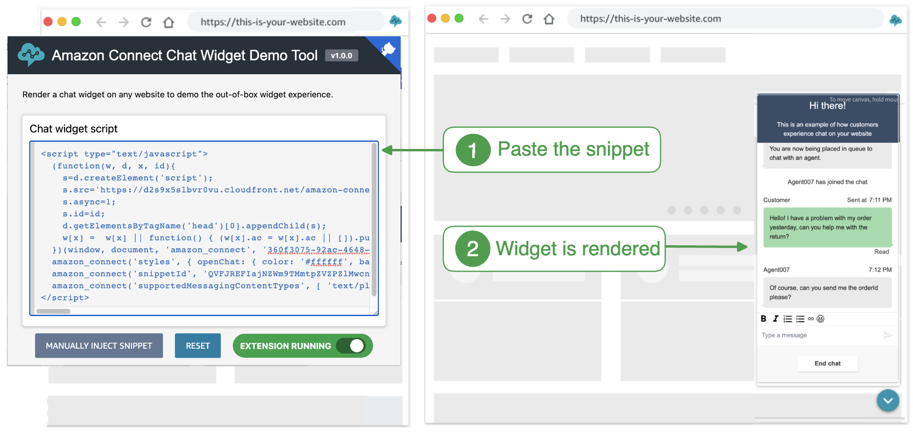
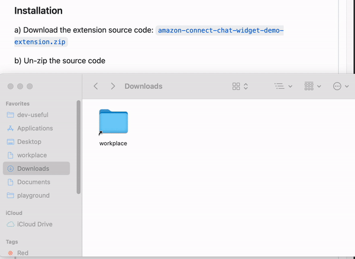
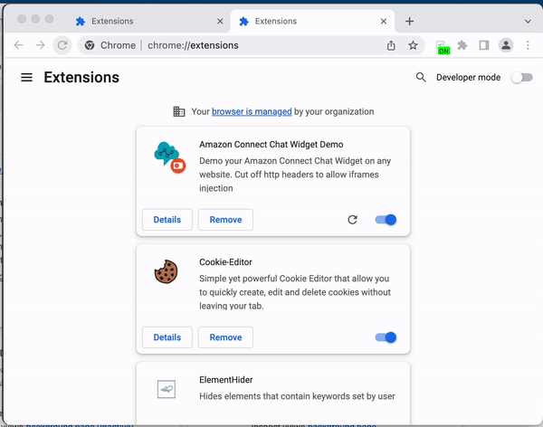
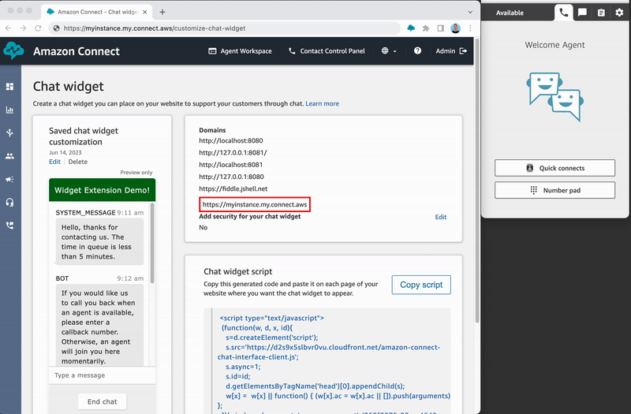

# Amazon Connect Widget Demo Chrome Extension 

> ⚠️ WARNING: for demo purposes only, this extension can diminish the security of your browser if left enabled

Unofficial tool to demo the Amazon Connect Widget on any website. Easily showcase the widget experience with simple copy/paste.

https://github.com/spencerlepine/amazon-connect-widget-demo-extension/assets/60903378/f498c647-46e0-4b7a-8d4d-d8f33fe226b3




## Prerequisites

- Create an Amazon Connect Instance [[guide](https://docs.aws.amazon.com/connect/latest/adminguide/amazon-connect-instances.html)]
  - OR: enable chat experience for an existing Connect instance. [[guide](https://github.com/amazon-connect/amazon-connect-chat-ui-examples#enabling-chat-in-an-existing-amazon-connect-contact-center)]
 
- Login to the Amazon Connect Admin Console: https://my-instance.my.connect.aws/home

- Head to the "Customze Chat Widget" page: https://my-instance.my.connect.aws/customize-chat-widget

- Customize and configure either an existing or new widget

- Save the snippet of the Amazon Connect Widget

  ```html
  <script type="text/javascript">
    (function (w, d, x, id) {
      s = d.createElement('script');
      s.src = 'https://d2s9x5slbvr0vu.cloudfront.net/amazon-connect-chat-interface-client.js';
      s.async = 1;
      s.id = id;
      d.getElementsByTagName('head')[0].appendChild(s);
      w[x] =
        w[x] ||
        function () {
          (w[x].ac = w[x].ac || []).push(arguments);
        };
    })(window, document, 'amazon_connect', '360f3075-9asdfsadfsadfasdfc3bfd');
    amazon_connect('styles', {
      openChat: { color: '#ffffff', backgroundColor: '#180113' },
      closeChat: { color: '#ffffff', backgroundColor: '#0085eb' }
    });
    amazon_connect('snippetId', 'QVFJRasdfasdfasdfasdfasdf...');
    amazon_connect('supportedMessagingContentTypes', ['text/plain', 'text/markdown']);
  </script>
  ```

## Installation

1. Download and unzip the extension source code: [`amazon-connect-widget-demo-extension.zip`](https://github.com/amazon-connect/amazon-connect-chat-ui-examples/raw/master/widgetSnippetChromeExtensionDemoTool/amazon-connect-widget-demo-extension.zip)



2. Install a [custom chrome extension](https://support.google.com/chrome/a/answer/2714278?hl=en#:~:text=Go%20to%20chrome%3A%2F%2Fextensions,the%20app%20or%20extension%20folder) with Developer mode



## Usage

> Note: widget will render by default. Press the "MANUALLY INJECT WIDGET" to re-render the widget

1. Add the desired website domain to the widget security: see ["Specify the website domains where you expect to display the chat widget"](https://docs.aws.amazon.com/connect/latest/adminguide/add-chat-to-website.html#chat-widget-domains)
2. Copy/paste your widget in the chrome extension


